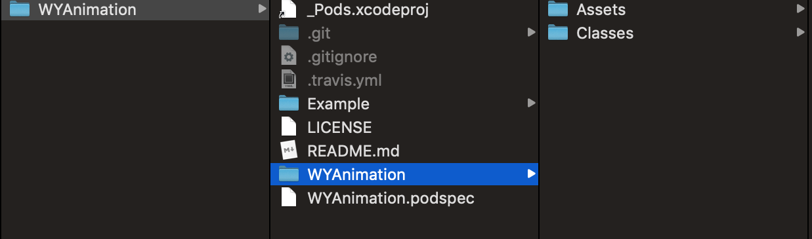
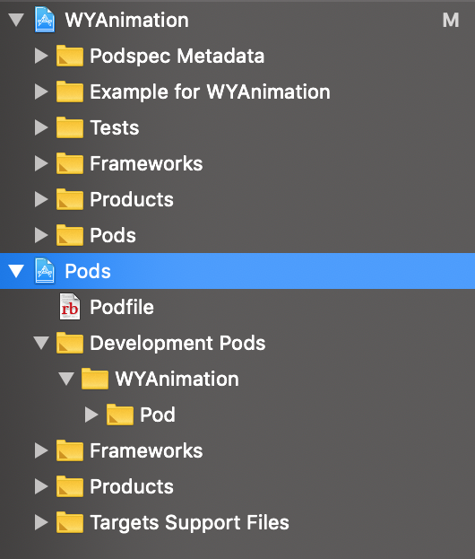

# 二进制化

新建一个pod库

```
pod lib create WYAnimation
```

此时，文件结构如下



然后

```
cd Example && pod install 
```



 然后开始写自建pod库的代码，放到Classes中，把资源放到Assets中，修改podspec


新建一个target，制作对应pod库的静态库


删除自带的WYAnimationBinary.h.m文件，再对target进行一些setting修改

build active Architecure only 设置为NO， 防止在build完后在某些机型上跑不起来


修改支持的版本和podspec中的一致


把无用代码过滤关掉，防止丢代码，把link标准库关掉


把pod库中的代码放到WYAnimationBinary，注意不要copy，这样以后修改pod中的代码，静态库的代码也可以同步更新，直接build新的静态库就可以了


.a是一个纯二进制文件，.framework中除了有二进制文件之外还有资源文件。

.a文件不能直接使用，至少要有.h文件配合，.framework文件可以直接使用。

指出要暴露的头文件


然后用WYAnimationBinary Target 在真机和模拟器 分别run一下


然后在Products中找到 针对真机和模拟器不同架构的 .a文件


将两个.a利用lipo合并一下。。 生成一个同时支持真机和模拟器架构的.a出来。。放到pod库里新建的Bin文件中。。


```
lipo -create 第一个.a的地址 第二个.a的地址 -output 合并后的.a的存放地址
```


把放需要暴露的.h文件的文件夹include,也放到Bin文件夹中


最后修改podspec就可以了


到这里就结束了

当`pod install`时就是源码形式


当`binary=1 pod install`时就是二进制形式


当有依赖的时候。。 注意两个事情

在新建完target后，记得把新建的target这个写到podfile中。这样可以避免找不到依赖的头文件错误


run代码时把新建的target加进去，单独run Target在target写到podfile以后会报错误。


到了开始使用的时候了，在一个新项目的podfile中指定需要依赖的pod库


如果需要二进制化，就 binary=1 pod install 否则直接pod install  就可以


遇到的问题是： 

在源码和二进制间转换的时候，会出问题，很容易就文件找不到了。 


是因为cache的原因。删除掉cache就可以了。 并删除pod文件夹，重新pod install  就好了

```
pod cache clean -all
```

但是删除掉cache。。 会导致install变慢。。 所以，如何解决这种情况呢。 


搞两个podspec。。 


后续：

1. 在单独的app尝试使用
2. 如何做到部分源码，部分二进制 
3. 如何做patch，部分引入，部分不引入
4. 二进制的部分用自动脚本做
5. 依赖平铺  

_zipURL	NSURL *	@"https://s3plus.sankuai.com/snsadminpicbucket/maoyanTheme.zip?AWSAccessKeyId=2b6f9c009a264149992963bf51f7cfeb&Expires=4704610197&Signature=3NYeQAA0aVriI3ImLgKskVWMc5k%3D"	0x0000600002aaef00

