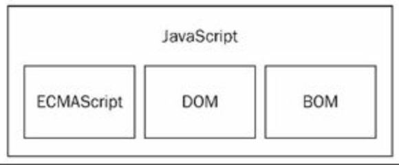
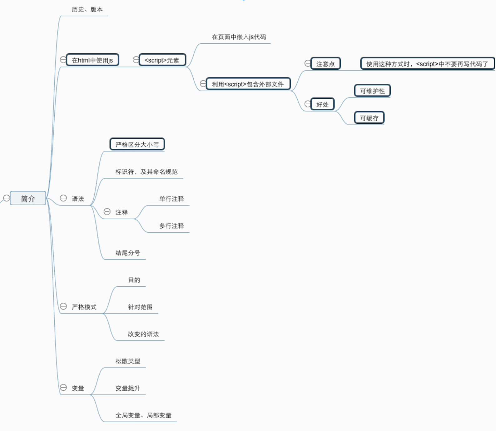
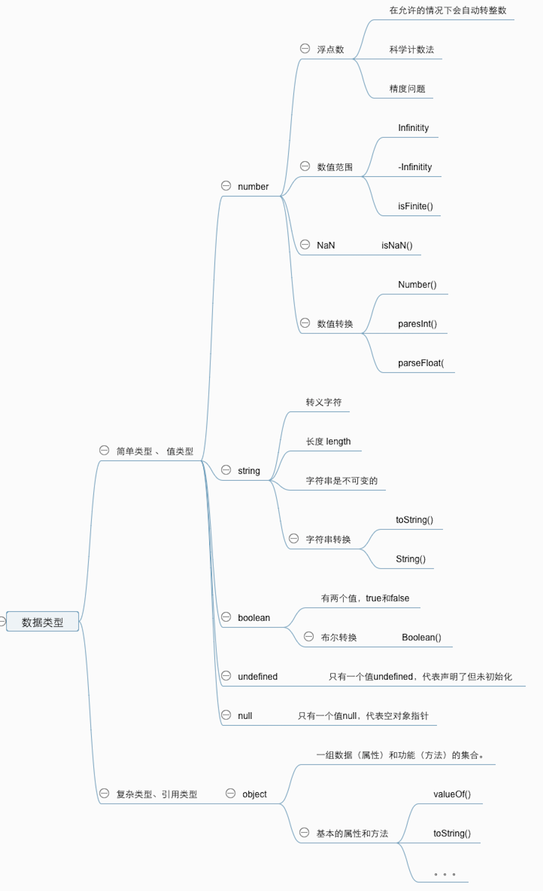

# 基本概念

## 历史

http://www.w3school.com.cn/js/pro_js_history.asp

明白几个概念：

1. LiveScript 、 JavaScript、java的关系：LiveScript 是 JavaScript的曾用名，因为的Java火热，为了蹭Java名气，改名叫JavaScript。

2. JavaScript最初的作用：为了表单验证

3. JavaScript、ECMAScript的关系： ECMAScript是标准，JavaScript是基于这个标准的实现。日常中不太区分。
   ES中规定了这门语言的组成部分

   □　语法
   □　类型
   □　语句
   □　关键字
   □　保留字
   □　操作符
   □　对象

   ECMAScript就是对实现该标准规定的各个方面内容的语言的描述。JavaScript实现了ECMAScript，Jscript、ActionScript同样也实现了ECMAScript，这几种语言还提供了ECMA规范外的额外功能。

   

## 版本

ES3标志着ECMAScript成为了一门真正的编程语言。

ES4步子太大，在第3版的基础上完成定义了一门新语言。

ES3.1是因为ES4的步子太大，对ES3的小幅修订，ES4在发布前被放弃。ES3.1变成了ES5。

ES6在 2015 年 6 月正式发布了。它的目标，是使得 JavaScript 语言可以用来编写复杂的大型应用程序，成为企业级开发语言。

## 在html中使用js

利用`<script>`元素。

有两种方式：

1. 在html页面中嵌入js代码，即

   ```html
   <!DOCTYPE html>
   <html lang="en">
   <head>
       <meta charset="UTF-8">
       <meta name="viewport" content="width=device-width, initial-scale=1.0">
       <meta http-equiv="X-UA-Compatible" content="ie=edge">
       <title>Document</title>
       <script> 
           // 注意这里
           var sum = 10;
           console.log(sum);
       </script>
   </head>
   <body>
       <div onclick="console.log(100)" style="height:200px; background-color:pink"></div> <!-- 注意这里，比较少见 -->
   </body>
   </html>
   ```

2. 使用<script>元素引入外部文件。

   > 注意: 使用这种方式时，<script>中不要再写代码了，不会起作用的
   >
   > 好处: 可维护性 、 可缓存

   ```html
   <!DOCTYPE html>
   <html lang="en">
   <head>
       <meta charset="UTF-8">
       <meta name="viewport" content="width=device-width, initial-scale=1.0">
       <meta http-equiv="X-UA-Compatible" content="ie=edge">
       <title>Document</title>
       <script src="./hello.js"> // 注意这里
       </script>
   </head>
   <body>
   </body>
   </html>
   ```

##语法

1. 严格区分大小写

2. 标识符 (变量/函数/属性的名字)

   > 由字母/数字/下划线/$组成, 不能以数字开头,一般采用驼峰命名法

3. 注释

   > 单行注释  `//`  多行注释 `/**/`

4. 每行结尾的分号可有可无，建议有


## 严格模式

除了正常运行模式，ECMAscript 5添加了第二种运行模式：["严格模式"](https://developer.mozilla.org/en-US/docs/JavaScript/Reference/Functions_and_function_scope/Strict_mode)（strict mode）。顾名思义，这种模式使得Javascript在更严格的条件下运行。

###目的

- 消除Javascript语法的一些不合理、不严谨之处，减少一些怪异行为;

- 消除代码运行的一些不安全之处，保证代码运行的安全；

- 提高编译器效率，增加运行速度；

- 为未来新版本的Javascript做好铺垫。

###进入标志

```js
"use strict"; // 在老版本的浏览器会忽略
```

### 针对范围

1. 整个脚本文件
   将`"use strict"`放在脚本文件的第一句，代表整个脚本都将以"严格模式"运行。

   ```html
   <script>
   	"use strict";
   	// 严格模式
   </script>
   ```

2. 针对单个函数
   将`"use strict"`放在函数体的第一句，代表整个函数以"严格模式"运行。

   ```js
   function func(){
   	"use strict";
   	// 严格模式
   }
   ```

3. 变通写法
   第一种方法不利于文件合并，可以将整个脚本放在一个立即执行的函数内。

   ```js
   (function(){
   	"use strict";
   })();
   ```

###语法改变

[严格模式](http://www.ruanyifeng.com/blog/2013/01/javascript_strict_mode.html) 

## 变量

###松散类型

ES的变量是松散类型的，所以用来保存任何类型的数据。定义变量要用var操作符，后跟一个标识符。

```js
var message; // 未初始化的变量，会保存一个特殊的值-undefined

var message = "hi"; // 声明并直接初始化

message = 100; // 松散类型，允许但是不推荐
```

### 变量提升

js的引擎工作方式是，先解析代码，获取所有被声明的变量，然后再一行行的运行，会造成所有的变量的声明语句，会被提升到代码的头部，这就是变量提升。

```js
console.log(a); 
var a = 1; 
```

上边的代码不会报错，因为变量提升，真正运行的是下面的代码。

```js
var a;
console.log(a); 
a = 1;
```

### 局部变量和全局变量

在函数内部用var定义的变量是局部变量，此变量在函数退出后会被销毁

```js
function test() {
    var messge = 'hi';
    console.log(message);
}
test();
alert(message); // 错误！
```

在函数内部省略var操作符，会创建一个全局变量

```js
function test() {
	messge = 'hi';
	console.log(message);
}
test();
alert(message); // "hi"
```

在上边的例子中省略了var操作符，因而message就成了全局变量。这样，只要调用过一次test()函数，这个变量就有了定义，就可以在函数外部访问。

省略var操作符的方式，不是推荐的做法，一方面很难维护，另一方面，给未经声明的变量赋值在严格模式下会报错。

###没有块级作用域

```js
function printColor() {
	if(true) {
		var color = "red";
	}
	console.log(color); // red  
}
printColor();
```

可以用匿名函数模仿块级作用域，在你希望有块级作用域的变量

```js
function printColor() {
	(function()	{
        if(true) {
			var color = "red";
	     }
    })();
	console.log(color); // 报错  
}
printColor();
```

## 数据类型

五种简单数据类型：`undefined` 、 `null` 、 `boolean` 、`number` 、`string`

一种复杂数据类型： `object`

### typeof操作符

`typeof`用来检测给定变量的数据类型，可能返回下列某个字符串

`"undefined"` -- 如果这个值未定义

`"boolean"` -- 如果这个值是布尔值

`"string"` -- 如果这个值是字符串

`"number"` -- 如果这个值是数值

`"object"` -- 如果这个值是对象或者null

`"function"` -- 如果这个值是函数

```
var message = "hi";
alert(typeof message);
alert(typeof(message));
```


> 1. typeof是一个操作符，不是一个函数，所以括号不是必须的
> 2. function是对象，而不是数据类型，但是函数确实有一些特殊的属性，所以会区分开
> 3. typeof null 会返回 "object"，因为null被认为是一个空的对象引用

### undefined类型

`undefined`类型只有一个值，即特殊的`undefined`。使用`var`声明变量但是未初始化，这个变量的值就是`undefined`.

包含undefined的值和未定义的值是不一样的

```js
var message; // 声明未初始化，值是undefined

alert(message); // undefined
alert(age); // 未声明 错误！
```

包含`undefined`的值和未定义的值，使用`typeof`检测数据类型时都是返回的`undefined`

```
var message; // 声明未初始化，值是undefined

alert(typeof message); // undefined
alert(typeof age); // 未声明 也返回 undefined
```

### null类型

`null`类型只有一个值，即特殊的`null`。`null`代表一个空对象指针。

```js
var car = null;
alert(typeof car); // object
```

如果准备定义的变量将来要用来保存对象，就应该将变量初始化为null而不是其他值，这样一来直接检查null值就可以知道是否已经保存了一个对象的引用。

```js
if(car != null) {
    // 操作car
}
```

`null`和`undefined`的用途完全不同，没必要将变量显示的设置为`undefined`，但是只要意在保存对象的变量还没有保存变量，就应该让该变量保存`null`值。

好处：

1. 区分`null`和`undefined`
2. 体现`null`作为空对象指针的惯例

> alert(null == undefined); // true
>
> alert(null === undefined); // flase


### boolean类型

只有两个值， `true`和`false`

可以调用`Boolean()`转型函数来将其他类型的值转换为对应的`boolean`值。

| 类型     | True           | False        |
| -------- | -------------- | ------------ |
| string   | 任何非空字符串 | ""(空字符串) |
| object   | 任何非空对象   | NA           |
| undefind | NA             | undefined    |
| null     | NA             | null         |
| number   | 任何非零数值   | 0和NaN       |

在执行某些流控制器语句（如`if`语句）时，会自动执行相应的`boolean`转换。

```js
var message = "hi";
if(message) {
    alert(message);
}
```


### number类型

#### 浮点数值

浮点数值，就是该数值中必须包含一个小数点，并且小数点后面必须至少有一位数字。

`var floatNum1 = 1.1;`

由于保存浮点数值需要的内存空间是保存数值的两倍，因为ES在可以的情境下会自动的把浮点数值转换为整数值。

`var floastNum1 = 1.; // 小数点后没有数字-解析为1`

`var floastNum2 = 10.0.; // 小数点后为0-解析为10`

可以用科学计数法表示极大或者极小的数值。

`var floatNum = 3.125e7;  //等于 31250000 `

在浮点数计算上会遇到精度问题，例如， `0.1+0.2` 结果不等于`0.3`,而是等于`0.30000000000000004`

```javascript
if(a + b == 0.3) { // 不要做这样的判断
    alert("0.3");
}
```

#### 数值范围

ES能表示的最小数值保存在 `Number.MIN_VALUE`中,一般是`5e-324`，能表示的最大数值保存在 `Number.MAX_VALUE`中,一般是`1.7976931348623157e+308`

如果超出数值范围的值，会自动转换成特殊的`Infinitity`，如果这个值是负的，则会转成`-Infinitity`,如果是正数，则会转成`Infinitity`

一旦一个数值返回了正或负的`Infinitity`值，就无法继续参与正常运算了，可以用`isFinite()`函数来判断一个数值是否是有穷的。

访问`Number.NEGATIVE_INFINITY`和`Number.POSITIVE_INFINITY`也能得到`-Infinitity`和`Infinitity`的值。

####NaN

`NaN`，即非数值（Not a Number）是一个特殊的数值，这个数值用于表示一个本来要返回数值的操作数未返回数值的情况。例如，任何数值除以`0`，在其他语言中会导致错误，但是在ES中会返回`NaN`，不会影响其他代码的执行。

1. `NaN`与任何值都不相同，包括`NaN`本身
2. 任何涉及`NaN`的操作都会返回`NaN`

ES中有一个函数`isNaN()`，此函数有一个参数，可以用来判断传入的参数是否“不是数值”。在接收到一个值之后，会尝试转换成数值，某些不是数值的值会利用`Number()`函数直接转换为数值。

```js
alert(isNaN(NaN)) // true
alert(isNaN(10)) // false
alert(isNaN("10") // flase
alert(isNaN("blue") // true     
```

#### 数值转换

有三个函数可以做非数值转换成数值:`Number()`、`parseInt()`和`parseFloat()`

#####Numebr()

`Number()` 可以用于任何数据类型，`parseInt()`和`parseFloat()`专门用于把字符串转成为数值。对相同的输入，会有不同的输出。

> `Number()`的转换规则
>
> * 如果是Boolean值，true和false将分别被转换为1和0。
> * 如果是数字值，只是简单的传入和返回。
> * 如果是null值，返回0。
> * 如果是undefined，返回NaN。
> * 如果是字符串，遵循下列规则：
>   * 如果字符串中只包含数字（包括前面带加号或负号的情况），则将其转换为十进制数值，即"1"会变成1，"123"会变成123，而"011"会变成11（注意：前导的零被忽略了）；
>   * 如果字符串中包含有效的浮点格式，如"1.1"，则将其转换为对应的浮点数值（同样，也会忽略前导零）；
>   * 如果字符串中包含有效的十六进制格式，例如"Oxf"，则将其转换为相同大小的十进制整数值；
>   * 如果字符串是空的（不包含任何字符），则将其转换为0
>   * 如果字符串中包含除上述格式之外的字符，则将其转换为NaN。
> * 如果是对象，则调用对象的`valueOf()`方法，然后依照前面的规则转换返回的值。如果转换的结果是`NaN`，则调用对象的`toString()`方法，然后再次依照前面的规则转换返回的字符串值

#####parseInt()

因为Number()函数在转换字符串时比较复杂而且不够合理，所以在处理整数的时候更常用的是`parseInt()`函数

`parseInt()`函数可以传入两个参数，第一个传入要转换的字符串，第二个传入的值的进制数。

> `parseInt()`函数在转换字符串时，会忽略字符串前面的空格，直至找到第一个非空格字符。
>
> 如果第一个字符不是数字字符或者正负号，`parseInt()`会返回NaN
>
> 如果第一个字符是数字字符或者正负号，则继续解析直到所有字符都解析完，或者遇到一个非数字字符。

```js
console.log(parseInt("1234blue"));  // 1234 
console.log(Number("1234blue"));    // NaN

console.log(parseInt(""));  // NaN
console.log(Number(""));  // 0

console.log(parseInt("b123")); // NaN
console.log(Number("b123")); // NaN

console.log(parseInt("22.5")); // 22
console.log(Number("22.5")); //22.5
 
console.log(parseInt("-123")); // -123
console.log(Number("-123")); // -123

console.log(parseInt("+123")); // 123
console.log(Number("+123"));   // 123
```

```js
console.log(parseInt("10",2));  // 2 按二进制解析
console.log(parseInt("10",8));  // 8 按八进制解析
console.log(parseInt("10",10)); // 10 按十进制解析
console.log(parseInt("10",16)); // 16 按十六进制解析
```

不指定第二参数的情况下，会让`parseInt()`决定如何解析输入的字符串，为了避免错误的解析，建议明确指定基数。

##### parseFloat()

`parseFloat()`与`parseInt()`不同之处

1. `parseFloat()`遇到的第一个小数点是有效的，而第二个小数点就是无效的了。
2. `parseFloat()`只解析十进制，第二个参数不会起作用

> Ps：如果字符串包含的是一个可解析为整数的数，（没有小数点，或者小数点后都是零），`parseFloat()`会返回整数。

```js
console.log(parseFloat("22.5.3")); // 22.5

console.log(parseInt("10", 2));  // 2
console.log(parseFloat("10", 2));  // 10 第二个参数不起作用
```

### string类型

string类型表示字符组成的字符序列，即字符串可以由双引号`""`也可以由单引号`''`表示，开始和结尾必须对应。

####字符字面量

```js
var name = "wangyu";
var name1 = "chenglong";
console.log(typeof name); // string
```

有一些特殊的转义序列。

`\n` `\t` `\\` `\"` `\'` 等等

##### length

可以通过`length`来访问字符串的长度。

```js
console.log("aa".length)  // 2
console.log("王昱".length) // 2
```

####字符串特点

ES中的字符串时不可变的。

```js
var lang = "Java"
lang = lang + "Script"
```

后台的操作过程： 先创建能容纳10个字符的新字符串，然后填充`"Java"`和`"Script"`,最后一步是销毁`"Java"`和`"Script"`，因为已经没用了。

#### 转换字符串

要把一个值转成为1个字符串有两种方式。

#####toString()

1. 使用`toString()`,返回相应值的字符串表现。数值、布尔值、对象、字符串值都有一个`toString()`方法，但是`null`和`undefined`值没有这个方法。
2. 大部分情况不必传递参数，在调用数值的`toString()`方法时，可以传递一个参数：输出数值的基数。

```js
var num = 10;
console.log(num.toString()); // 10
console.log(num.toString(2)); // 1010
console.log(true.toString()); // true
console.log({toString:function(){ 
             return "开心"；
            }}.toString()); // 开心
console.log(null.toString());  // 报错
console.log(undefined.toString()); // 报错
```

在不能确定要转换的值是不是null或undefined的情况下，还可以使用转型函数`String()`,这个函数可以将任何类型的值转成字符串

#####String()

1. 如果值有`toString()`方法，则调用该方法并返回结果
2. 如果值是`null`，返回`"null"`
3. 如果值是`undefined`，返回`"undefined"`

```js
console.log(String({toString:function(){ 
             return "开心"；
            }}); // 开心
console.log(String(null));  // null
console.log(String(undefined));// undefined
```


### Object类型

ES中的对象其实就是一组数据和功能的集合。对象可以通过new操作符后跟要创建的对象类型的名称来创建。而创建Object类型的实例并为其添加属性和方法，就可以创建自定义对象。

```js
var o = new Object();
```

在ES中，Object类型是所有它的实例的基础。

 Object的每个实例都具有下列属性和方法。

* `Constructor`：保存着用于创建当前对象的函数。对于前面的例子而言，构造函数（`Constructor`）就是`Object()`
* `hasOwnProperty(propertyName)`：用于检查给定的属性在当前对象实例中（而不是在实例的原型中）是否存在。其中，作为参数的属性名（propertyName）必须以字符串形式指定（例如：o.hasOwnProperty（"name"））。
* `isPrototypeOf(object)`：用于检查传入的对象是否是另一个对象的原型（第5章将讨论原型）。
* `propertyIsEnumerable(propertyName)`：用于检查给定的属性是否能够使用for-in语句（本章后面将会讨论）来枚举。与hasOwnProperty()方法一样，作为参数的属性名必须以字符串形式指定。
* `toLocaleString()`:返回对象的字符串表示，该字符串与执行环境的地区对应。
* `toString()`：返回对象的字符串表示。
* `valueOf()`：返回对象的字符串、数值或布尔值表示。通常与toString()方法的返回值相同。

```js
var o = new Object()
o.name = "wangyu"
o.age = 25
o.array = [1, 2, 3]
console.log(o.constructor);  // function Object() { … }
console.log(o.hasOwnProperty("name")); // true
console.log(Object.prototype.isPrototypeOf(o)); // true
console.log(Object.isPrototypeOf(o)); // ** false
console.log(o.propertyIsEnumerable("array")); // true
console.log(o.propertyIsEnumerable("name")); // true
console.log(o.toLocaleString());  // [object Object]
console.log(o.toString());  // [object Object]
console.log(o.valueOf());  //  Object {name: "wangyu", age: 25, array: Array(3)}
```

在ES中，Object是所有对象的基础，因为所有对象都具有这些基本的属性和方法。

复习：



