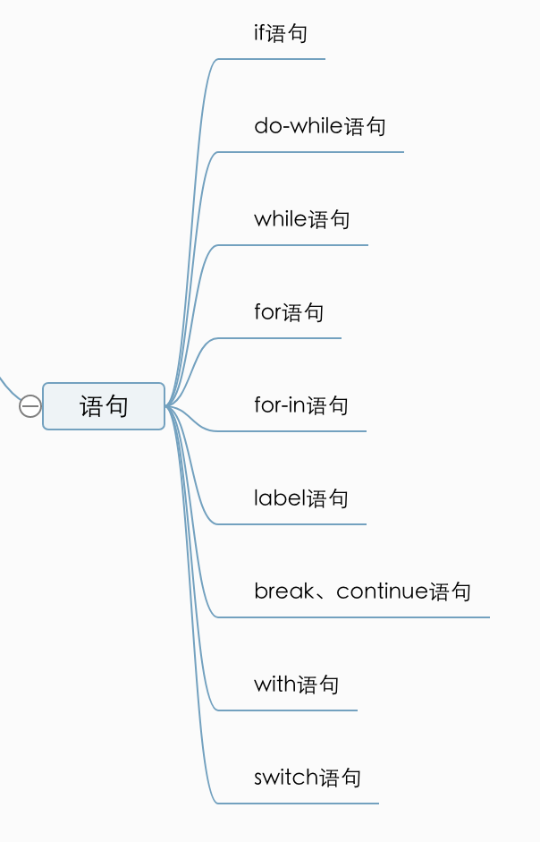

# 语句

## if语句

## do-while语句

## while语句

## for语句

## for-in 语句

枚举对象的属性。

ES中对象的属性没有顺序，所以通过`for-in`输出的属性名的顺序是不可预测的。

如果要迭代的对象的变量值位`null`或者`undefined`,`for-in`语句在ES5前会抛出错误。建议在使用`for-in`循环之前，先检测对象的值不是`null`或`undefined`

```js
var person = {
    age: 15,
    name: "wangyu"
}

for (var property in person) {
    console.log(property); // age/ name 
}
```

## label语句

使用`label`语句可以在代码中添加标签，以便将来使用。

语法:

`label : statement`

一般与`for`语句等循环语句配合使用。

可以在将来由`break`和`continue`语句引用。

```js
var num = 0;
outer: for (var i = 0; i < 10; i++) {
    for (var j = 0; j < 10; j++) {
        if(i === 5 && j === 5){
            break outer; // break 掉外层循环
            // break; 直接用break语句，会返回95
        }
        num++;
    }
}
console.log(num); // 55 
```

## break 和 continue语句

## with语句

严格模式下，不允许使用with语句。

而且使用`with`语句，会导致性能下降，不建议使用。所以不用学了。

利用`with`主要为了简化多次编写同一个对象的工作。

```js
var person = {
    age : 15,
    name : "wangyu"
}

console.log(person.name) // wangyu
console.log(person.age) // 15

// 利用with

with(person) {
    int age = 10
	console.log(name) // wangyu
    console.log(age) // 10
}
```

在上面的例子中，使用`with`语句关联了`person`对象， 在`with`语句内部，每个变量首先被认为是一个局部变量，而如果在局部变量中找不到该变量的定义，就会去找`person`的属性，如果发现同名属性，则返回对象的属性值。

## switch语句

1. siwtch语句中可以使用任何数据类型（在很多其他语言中只能用数值），无论字符串、对象都可以
2. 每个case的值不一定是常量，可以是变量，甚至是表达式。

```js
switch ("hello world") {
    case "hello " + "world":
        console.log("找到了world");
        break;
    case "hello " + "wangyu":
        console.log("找到了wangyu");
        break;   
    default: 
         console.log("找不到了");
}
//找到了world 
```

>  switch语句在比较值时使用的是全等操作符。

## 复习 

