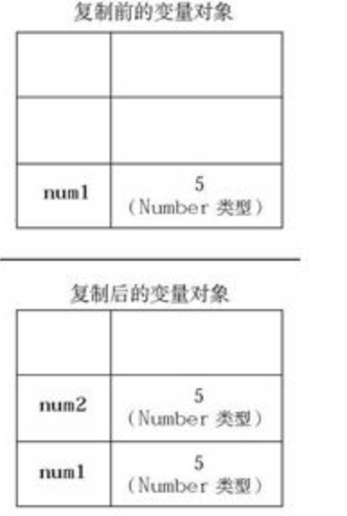
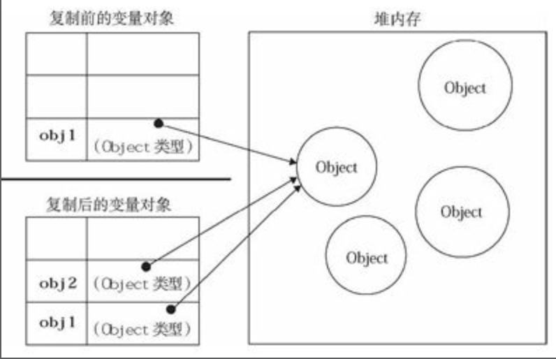
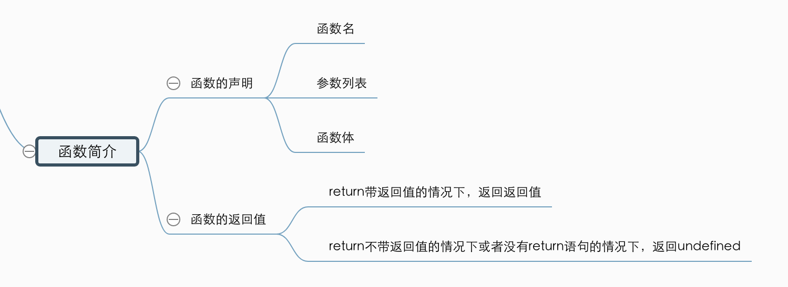
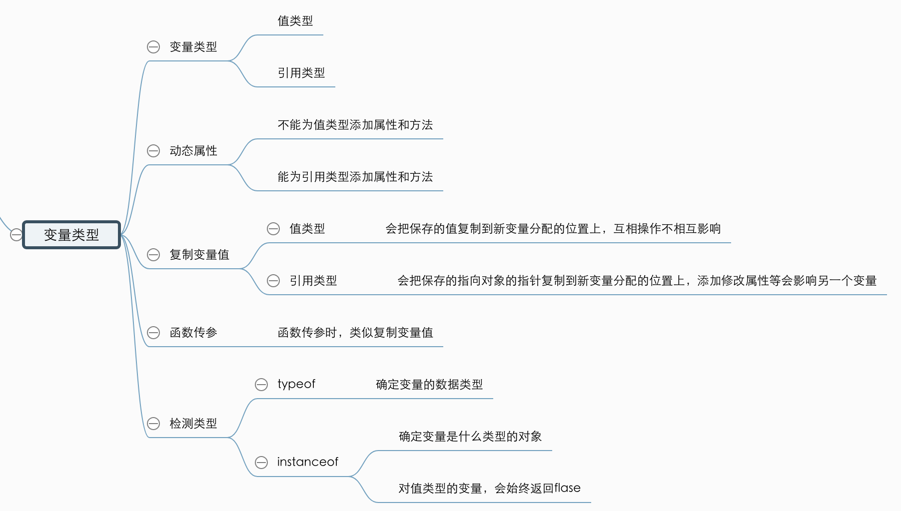

# 函数简介、变量

##函数简介

ES中的函数使用`function`关键字来声明，后跟一组参数及函数体，基本语法如下

```js
funtion funcName(arg0, arg1, arg2) { // 函数名 (参数0，参数1)
    // 函数体
}
```

调用时，通过函数名来调用，后面还要跟上圆括号以及参数，多个参数用逗号隔开。

ES中，函数不必指定是否有返回值。但是任何函数都可以通过`return`语句返回返回值。

```js
function sum(num1, num2) {
    return num1 + num2;
}

var result = sum(10, 10);
console.log(result); // 20
```

函数在遇到`return`后会停止并立即退出，在`return`后的函数永远不会执行。

如果没有`return`语句的函数，或者`return`语句不带任何返回值的情况下，函数将返回`undefined`

```js
function sum(num1, num2) {
	console.log(num1 + num2); // 9
}
var result = sum(5, 4);
console.log(result); // undefined;
```

## 变量

ES变量可能包含两种类型：值类型（基本类型）、引用类型。

在给一个变量赋值时，解析器必须确定这个值是基本类型值还是引用类型值。

5种基本数据类型是按值访问的，可以操作保存在变量中的值。

引用类型的值是指向对象的指针。

> 在很多语言中，字符串以对象的形式来表示，因为被认为是引用类型的，但是在ES中放弃了这个传统。

### 动态的属性

对于引用类型的变量，可以为其添加属性和方法，也可以改变和删除其属性和方法

```js
var person = new Object();
person.name = "wangyu";
console.log(person.name); // 王昱
```

对于值类型的变量，不可以为其添加属性和方法，即使这样不会报错。

```js
var name = "wangyu";
name.age = 15;
console.log(name.age); // undefined
```

### 复制变量值

#### 从一个变量向另一个变量复制时

当变量时一个值类型时，会把值复制到新变量分配的位置上，这两个变量可以任意操作而不相互影响。



```js
var num1 = 10;
var num2 = num1;
```

当变量是一个引用类型时，同样会将变量中的值复制一份放到新变量分配的空间中，但这个值的副本是一个指向堆中对象的指针。因此改变其中一个变量的属性，会影响另一个变量。



```js
var object1 = new Object();
var object2 = object1;
object2.name = "wangyu";
console.log(object1.name); // wangyu
```

### 传递参数

ES中所有函数的参数都是按值传递的。把函数外部的值复制给函数内部的参数，就和把值从一个变量复制到另一个变量一样。

### 检测类型 （* 这里有个概念就可以）

typeof操作可以确定一个变量的数据类型。

但是在检测引用类型的值时，这个操作符的用处不大，因为我们一般不仅想知道这个值是对象，还想知道它是什么类型的对象。

ES中提供了 `instanceof`操作符,可以达到这个效果

> 如果变量是给定引用类型的实例（根据原型链来识别），那么`instanceof`操作符就会返回`true`。如果值类型的变量，那么始终会返回`false`，因为基本类型就不是对象。

语法：

```js
result = variable instanceof constructor
```

实例：

```js
var colors = ["red", "blue"];
function Person(name) {
    this.name = name;
}
var person = new Person("王昱");
console.log(colors instanceof Array); // true
console.log(person instanceof Person); // true
```

复习：






## 执行环境及作用域

执行环境是`js`中最为重要的一个概念

执行环境定义了变量或函数有权访问的其他数据，决定了他们各自的行为。

每个执行环境都有一个与之关联的变量对象，环境中定义的所有变量和函数都保存在这个对象汇总。