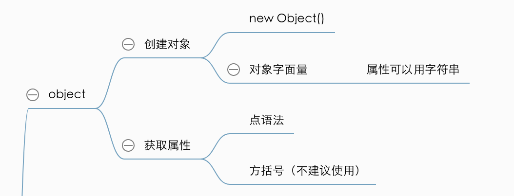
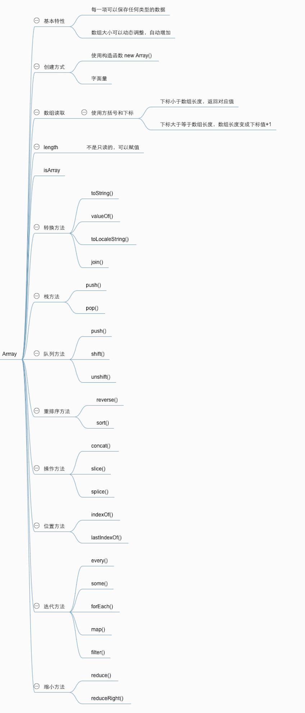

# 引用类型

引用类型的值是引用类型的一个实例。在ES中，引用类型是一种数据结构，用于将数据和功能组织在一起。

> 引用类型和类看起来相似，但他们不是相同的概念。

新对象是由new操作符后跟一个构造函数来创建的。构造函数本身就是一个函数，但是它是出于创建新对象的目的而定义的。

除了Object是引用类型， 还有一些内置的引用类型Array/Date/Math等

## Object类型

创建Object实例的方式有两种：

第一种是使用new操作符后跟Object构造函数：

```js
var person = new Object();
person.name = "Wang";
person.age = 30;
```

另一种是使用字面量表示法：

```js
var person = {
    name: "wang",
	age: 30 // 最后一个属性后面不要加逗号
}
```

在使用对象字面量语法时，属性名也可以使用字符串

```js
var person = {
    "name" : "wang",
    "age" : 29,
    5 : true // 数值属性名会自动转成字符串
}
```

一般来说，访问对象属性使用的都是点语法，但是在js中也可以用方括号来访问对象属性。

```js
alert(person.name) // 建议使用点语法
alert(person["name"])
```

```js
var person = {
    "name": "wang",
    "age": 29,
    5: true // 数值属性名会自动转成字符串
}

console.log(person[5]); // true
console.log(person["5"]); // true
console(person.5); // 报错
```


## Array类型

ES中的数组的每一项可以保存任何类型的数据，而且ES数组的大小是可以动态调整的，即可以随着数据的添加自动增长以容纳新增数据。

创建数组的方式有两种，一种是使用构造函数

```js
var colors = new Array();
var colors = new Array(20); // 将创建length为20的数组
var colors = new Array("red","blue","black"); // 长度为3的数组
```

给构造函数传递一个值也可以创建数组，当值是数值时，代表length为此值，当值是其他类型是，代表创建一个只包含此值的数组。

```js
var colors = new Array(3);  // 包含3项的数组
var coloars = new Array("greg"); // 包含1项的数组 
```

在使用构造函数时，可以省略new操作符。

第二种方式是使用字面量

```js
var colors = ["red","blue","black"]; // 包含3项的数组
var names = []; // 空数组
var values = [1,2,]; // 不要这样，最后一项后不要加逗号，可能会创建一个3项也可能创建一个2项的
```

在读取或者设置数组的值的时候，要用方括号和下标值。如果下标小于数组的长度，则返回对应的值，否则数组的长度就自动变成下标加1的值。

```js
var colors = ["red","blue","black"]; 
console.log(colors[0]);
colors[2] = "green"; 
colors[5] = "brown";  // 此时colors.length === 6
```

数组的length有一个特点-不是只读的。length是可以赋值的。

```js
var colors = ["red","blue","black"]; 
colors.length = 2;
console.log(colors[2]); // undefined
colors[colors.length] = "green"; //在数组末尾添加新项
```

###检测方法

可以用`Array.isArray()`来确定某个值到底是不是数组。

> 因为instanceof操作符的问题在于，网页中如果包含多个框架，从一个框架中向另一个框架中传入一个数组，那么传入的数组与在第二个框架中原生创建的数组分别具有不同的构造函数。

###转换方法

所有对象都有`toLocaleString()`、`toString()`和`valueOf()`方法。

调用数组的`toString()`和`valueof()`方法会返回同样的值，会调用数组中的每一项值的`toString()`方法，拼接在一起并且用逗号分隔开。

调用数组的`toLocaleString()`会调用数组中的每一项值的`toLocaleString()`方法，拼接在一起并且用逗号分隔开。

`join()`方法只接收一个参数，即用作分隔符的字符串，然后返回包含所有数组项的字符串

```js
var person1 = {
    toString: () => "person1",
    toLocaleString: () => "localePerson1"
};
var person2 = {
    toString: () => "person2",
    toLocaleString: () => "localePerson2"
};
var peoples = [person1, person2]; 
console.log(peoples.toString()); // person1,person2
console.log(peoples.toLocaleString()); // localePerson1,localePerson2
console.log(peoples.join("&")); // person1&person2
```

### 栈方法

`push()` 和`pop()`方法

>  `push()`可以接受多个参数，并将它们逐个添加到数组末尾
>
> `pop()`将数组的最后一项移除，并且令数组的length值减1

```js
var stack = new Array();
stack.push(3, 2, 1);
console.log(stack.toString());  // 3,2,1
stack.pop();
stack.pop();
console.log(stack.toString()); // 3
```

### 队列方法

`push() `和`shift()`方法

> `push()`可以接受多个参数，并将它们逐个添加到数组末尾
>
> `shift()`能移除数组中的第一项并返回该项，并且令数组的length值减1

ES还为数组提供了一个`unshift()`方法，跟`shift()`方法用途相反。

> `unshift()`能够在数组前端添加任意个项并且返回新数组的长度

```js
var colors = new Array();
colors.unshift("red", "green")
console.log(colors.toString()) // red,green
console.log(colors.shift()) // red
```

### 重排序方法

`reverse()`和`sort()`

> `reverse()`方法会反转数组项的顺序
>
> `sort()`方法会排序数组项，默认情况下是升序排列，会调用每个数组项的`toString()`转型方法，然后比较得到的字符串，以确定如何排序。

```js
var values = [0, 1, 5, 10, 15];
values.reverse();
console.log(values.toString()); // 15,10,5,1,0
values.sort();
console.log(values.toString()); // 0,1,10,15,5
```

所以，在很多情况下，`sort()`并不是最佳方案。因此`sort()`方法可以接受一个比较函数作为参数，以便指定哪个值位于哪个值前。

比较函数接收两个参数，如果第一个参数应该位于第二个值之前返回负数，如果两个参数相等则返回0，如果第一个参数应该位于第二个之后则返回一个正数。

```js
var compare = (value1, value2) => value1 - value2; // 可能溢出的情况下别这么写
var values = [9, 16, 5, 10, 15];
values.sort(compare);
console.log(values.toString()); // 5,9,10,15,16
```

### 操作方法

`concat()`方法可以基于数组中所有项创建一个新数组。

>  参数：
>
>  如果没有传递参数，`concat()`方法只是复制当前数组返回副本。
>
>  如果传入的是一些值，则将这些值添加到结果数组的末尾
>
>  如果传入一个或多个数组，则将这些数组中的每一项挨个添加到结果数组的末尾
>
>  不会影响原始数组

```js
var numbers = [1, 2, 3, 4, 5];

var result = numbers.concat()

console.log(result.toString()); //  1,2,3,4,5

result = result.concat(6, 7)

console.log(result.toString()); //  1,2,3,4,5,6,7

result = result.concat([8, 9], [10, 11, 12])

console.log(result.toString()); // 1,2,3,4,5,6,7,8,9,10,11,12

console.log(numbers.toString()); // 1,2,3,4,5
```

> `slice()`方法可以接受一或两个参数，
>
> 1. 在只有一个参数的情况下，`slice()`方法返回从该参数指定位置开始到当前数组末尾的所有项，
> 2. 如果有两个参数，改方法返回起始和结束位置之间的项，但不包括结束位置的项。
>
> 3. `slice()`方法不会影响原始数组。
> 4. 如果参数中有负数，则用数组长度加上改数来确定相应的位置。

```js
var numbers = [0, 1, 2, 3, 4, 5];
console.log(numbers.slice(2));  //  [2, 3, 4, 5]
console.log(numbers.slice(2, 4));  //  [2, 3]
console.log(numbers.slice(-4, -2)); // [2, 3]
```

`splice()`方法是最大强大的数组方法。

> 接受三个参数: 要删除的第一项的位置、要删除的项数、要插入的项。
>
> 返回值是从原数组中删除的项目，未删除任何项时返回空数组。
>
> 可以进行插入、删除、替换

```js
// 删除
var numbers = [0, 1, 2, 3, 4, 5];
console.log(numbers.splice(2, 1).toString()) // 2
console.log(numbers.toString()) // 0,1,3,4,5

// 插入
numbers = [0, 1, 2, 3, 4, 5];
console.log(numbers.splice(2, 0, 2).toString()) // 空数组
console.log(numbers.toString()) // 0,1,2,2,3,4,5

// 替换
numbers = [0, 1, 2, 3, 4, 5];
console.log(numbers.splice(2, 2, 7, 8).toString()) // 2,3
console.log(numbers.toString()) // 0,1,7,8,4,5

```

### 位置方法

`indexOf()` 和`lastIndexOf()`都接收两个参数：要查找的项和（可选）表示查找起点位置的索引。

`indexOf()` 从数组的开头开始向后查找

`lastIndexOf()`从数组的末尾开始向前查找

```js
var numbers = [0, 1, 2, 3, 4, 3, 2, 1, 0];
console.log(numbers.indexOf(2));  // 2
console.log(numbers.lastIndexOf(2)); // 6
console.log(numbers.indexOf(2, 4));  // 6
console.log(numbers.lastIndexOf(2, 4)); // 2
```

### 迭代方法

定义了五个迭代方法。每个方法接收两个参数：要在每一项上运行的函数和（可选的）运行该函数的作用域对象——影响`this`的值。传入这些方法的函数会接受三个参数：数组项的值、该项在数组中的位置和数组对象本身。

> `every()`：对数组中的每一项运行给定函数，如果该函数对每一项都返回`true`，则返回`true`，当任一项返回`false`时，就不会继续运行了。
>
> `some()`：对数组中的每一项运行给定函数，如果该函数有任意一项返回`true`，则返回`true`，且不会继续运行了。
>
> `forEach()`：对数组中的每一项运行给定函数。这个方法没有返回值。
>
> `map()`：对数组中的每一项运行给定函数，返回每次函数调用的结构组成的数组。
>
> `filter()`：对数组中的每一项运行给定函数，返回该函数会返回`true`的项组成一个数组。

`every()` 和`some()`的`example`:

```js
var numbers = [0, 1, 2, 3, 4];

var result = numbers.every(function (item, index, array) {
    array[index] += 10
    return item !== index;
});
console.log(result); // false
console.log(numbers); // 当返回false的时候就停止了。所以numbers是[10, 1, 2, 3, 4]

numbers = [0, 1, 2, 3, 4];
var person = {
    age: 2
};
result = numbers.some(function (item, index, array) {
    console.log(this);    // person对象
    array[index] += 10
    return item === this.age;
}, person);

console.log(result); // true
console.log(numbers); // 当返回true的时候就停止了。所以numbers是[10, 11, 12, 3, 4]
```

`map()`和`filter()`的`example`:

```js
var numbers = [0, 1, 2, 3, 4];
result = numbers.map(function (item, index, array) {
    return item * 2
})
console.log(result); // [0, 2, 4, 6, 8]
console.log(numbers); // [0, 1, 2, 3, 4]

result = numbers.filter(function (item, index, array) {
    return item % 2 === 0;
})
console.log(result); // [0, 2, 4]
console.log(numbers); // [0, 1, 2, 3, 4]
```

`forEach()`的`example`:

```js
var result = numbers.forEach(function (item, index, array) {
    console.log(item)  // 0 1 2 3 4 
})

console.log(result); // undefined
console.log(numbers); // [0, 1, 2, 3, 4]
```

###缩小方法

`reduce()`和`reduceRight()`方法，会迭代数组的所有项，然后构建一个最终返回的值。

`reduce()`方法从数组的第一项开始，逐个遍历到最后

`reduceRight()`方法从数组的最后一项开始，逐个遍历到最前

这两个函数都接受两个参数：

1. 在每一项上调用的函数，函数接收四个参数，前一个值、当前值、项的索引和数组对象。
2. (可选）作为缩小基础的初始值。

如果没有初始值，第一次迭代发生在数组的第二项。

```js
var numbers = [1, 2, 3, 4, 5];
var result = numbers.reduce(function (pre, cur, index, array) {
    console.log(`${pre} --- ${cur} --- ${index}`);
    return pre + cur;
})
console.log(result); 

// 输出结果：
1 --- 2 --- 1
3 --- 3 --- 2
6 --- 4 --- 3
10 --- 5 --- 4
15

result = numbers.reduce(function (pre, cur, index, array) {
    console.log(`${pre} --- ${cur} --- ${index}`);
    return pre + cur;
}, 10)
console.log(result);
// 输出结果：
10 --- 1 --- 0
11 --- 2 --- 1
13 --- 3 --- 2
16 --- 4 --- 3
20 --- 5 --- 4
25
```

复习：







## Function类型

函数实际上是对象，每个函数都是Function类型的实例，而且都与其他引用类型一样具有属性和方法。由于函数是对象，因为函数名实际上也是一个指向函数对象的指针，不会与函数绑定。

有三种定义函数的方式，第一种利用函数声明语法定义，第二种是利用函数表达式定义函数，第三种方式是利用Function构造函数。

```js
function sum (num1, num2) {
	return num1 + num2;
}

var sum = function(num1, num2) {
    return num1 + num2;
}

var sum = new Function(num1, num2, "return num1 + num2") // 不推荐
```

由于函数名仅仅是指向函数的指针，所以函数名和其他包含对象指针的变量没什么不同，比如：一个函数可以有多个名字。

```js
var sum = function(num1, num2) {
    return num1 + num2;
}
var otherSum  = sum;
console.log(otherSum(1,2)) // 3
sum = null;
console.log(otherSum(1,2)) // 3
```

### 没有重载

当有两个同名函数时，结果是后边的函数会覆盖掉前面的函数。

```
function sum(num1) {
	return num1 + 100;
}

function sum(num1) {
    return num1 + 200;
}

console.log(sum(100)); // 300
```

相当于

```
var sum = function (num1) {
	return num1 + 100;
}

sum = function (num1) {
    return num1 + 200;
}

console.log(sum(100)); // 300
```

在创建第二个函数时，实际上覆盖了第一个函数的引用

### 函数声明和函数表达式

解析器会率先读取函数声明，并使其在执行任何代码之前可用；至于函数表达式，则必须等到解析器执行到它所在的代码行，才会真正被解释执行。

```js
console.log(add100(10))
function add100(num) {
    return num + 100;
}
```

因为函数声明提升的原因，这个代码是可以正常运行的。

```js
console.log(add100(10))
var add100 = function(num) {
    return num + 100;
}
```

因为函数表达式没有提升的一个过程，所以这个代码是报错的

除此之外，函数声明和函数表达式他们是等价的。

###作为值的函数

因为ES的函数名本身就是个变量，所以函数也可以作为其他函数的参数，也可以作为其他函数的返回值。

作为其他函数的参数：

```js
var add100 = function(num){
	return num + 100;
}

var add200 = function(num){
	return num + 200;
}

function callOtherFunction(func, num) {
    return func(num);
}

var result = callOtherFunction(add100, 10); //  110
result = callOtherFunction(add200, 10); //  120
```

作为其他函数的返回值：

```js
function createCompareFnWithProperty(propertyName) {
    return function(object1, object2) {
        var value1 = object1[propertyName];
        var value2 = object2[propertyName];
        if (value1 < value2) {
            return -1;
        }else if(value1 > value2){
            return 1;
        }else {
            return 0;
        }
    }
}

var data = [{
    name: "lisi",
    age: 60
}, {
    name: "wangyu",
    age: 50
}];

data.sort(createCompareFnWithProperty("age"));

console.log(data[0]); // Object {name: "wangyu", age: 50}
```

### 函数内部属性

在函数内部有两个特殊的对象：`arguments` 和 `this`。

ES函数的不介意传递进来多少个参数，也不在乎传进来的是什么类型。可以通过`arguments`对象来访问这个传入的所有参数。

  `arguments`是类数组对象，包含着传入函数中的所有参数。与数组类似（不是Array的实例），可以使用方括号语法访问它的每一个元素，而且可以用length来确定传递进来多少参数。

>  需要注意的是，虽然`arguments`很像数组，但它是一个对象。数组专有的方法（比如`slice`和`forEach`），不能在`arguments`对象上直接使用。
>
> 如果要让`arguments`对象使用数组方法，真正的解决方法是将`arguments`转为真正的数组。下面是两种常用的转换方法：`slice`方法和逐一填入新数组。
>
> ```js
> var args = Array.prototype.slice.call(arguments);
> 
> // 或者
> var args = [];
> for (var i = 0; i < arguments.length; i++) {
>   args.push(arguments[i]);
> }
> ```

```
var sum = function () {
    var result = 0;
    for (var i = 0; i < arguments.length; i++) {
        result += arguments[i];
    }
    return result;
}
console.log(sum(10, 15));  //  25
console.log(sum(10, "20", 30));  // 102030
```

这个对象还有个`callee`的属性，该属性是一个指针，指向拥有这个`arguments`对象的函数。

在递归时，有些可能会出现这样的问题

```js
// 为了演示,平时写斐波那契别这么写,用动态规划
var sum = function (n) {
    if (n == 1) {
        return 1;
    } else if (n == 0) {
        return 0;
    }
    return sum(n - 1) + sum(n - 2);  // ****会在这里报错***
}

var otherSum = sum;
sum = null;
console.log(otherSum(7));   
```

解决方案就是用`callee`属性

```js
var sum = function (n) {
    if (n == 1) {
        return 1;
    } else if (n == 0) {
        return 0;
    }
    return arguments.callee(n - 1) + arguments.callee(n - 2);
}
var otherSum = sum;
sum = null;
console.log(otherSum(7));  // 13
```

[但是，`arguments.callee()`在严格模式下不让用](https://developer.mozilla.org/zh-CN/docs/Web/JavaScript/Reference/Functions/arguments/callee)

```js
// 可以用这种方式：
var sum = (function f(n) {

    if (n == 1) {
        return 1;
    } else if (n == 0) {
        return 0;
    }
    return f(n - 1) + f(n - 2);
});
var otherSum = sum;
sum = null;
console.log(otherSum(10));
```

函数内部的另一个特殊对象是`this`。

在一个对象中绑定函数，称为这个对象的方法。

在JavaScript中，对象的定义是这样的：

```js
var xiaoming = {
    name: '小明',
    birth: 1990,
    age: function () {
        var y = new Date().getFullYear();
        return y - this.birth;
    }
};
```

绑定在对象上的函数被称为方法，和普通函数没啥却别，但是它在内部使用了一个`this`关键字，在一个方法内部，他始终指向当前对象，所以，`this.birth`可以拿到`xiaoming`的`birth`属性。

让我们拆开写

```js
function getAge() {
    var y = new Date().getFullYear();
    return y - this.birth;
}

var xiaoming = {
    name: '小明',
    birth: 1990,
    age: getAge
};

xiaoming.age(); // 25, 正常结果
getAge(); // NaN
```

在调用函数之前，this的值是不确定的，可能在代码执行过程中引用不同的对象。

如果使用`xiaoming.age()`，该函数指向被调用的对象，也就是`xiaoming`

如果单独调用函数，比如`getAge()`，该函数指向全局对象

```js
var fn = xiaoming.age; // 先拿到xiaoming的age函数
fn(); // NaN
```

要保证`this`执行正确,必须用`obj.xxx()`的形式调用

因为这个情况，在严格模式下，让函数`this`指向`undefined`，这样可以让错误及时暴露出来

```js
'use strict';
var fn = xiaoming.age; // 先拿到xiaoming的age函数
fn(); // 报错
```

### 函数属性和方法

ES中的函数是对象，因此函数也有属性和方法，每个函数都包含两个属性，`length`和`prototype`。

其中`length`属性表示函数希望接受的命名参数的个数。

```js
function func1(num) {
}
console.log(func1.length); // 1
function func2(num1, nums2) {
}
console.log(func2.length); // 2
```

另一个属性，`prototype`是ES中最耐人寻味的属性。在创建自定义引用类型以及实现继承时，`prototype`是非常重要的，这里不细讲了

> 在ES5中，`prototype`属性是不可枚举的，在使用`for-in`时无法发现

每个函数都包含两个非继承而来的方法：`apply()`和`call()`，这两个方法的用途都是用来设置函数体内`this`对象的值。

`apply()`函数的接收两个参数，一个是要设置this的值，另一个是参数数组

`call()`函数与`apply()`函数大体相同，区别在与，其余参数是挨个列举出来传递给函数的。

ES5中还定义了一个方法：`bind()`，这个函数会创建一个函数的实例，其this值会被绑定到传给`bind()`函数的值。

```js
function sum(num1, num2, num3) {
    return num1 + num2 + num3 + this.num;
}
var object = {
    num:15
};
console.log(sum.apply(object, [1,2,3])); //  21
console.log(sum.call(object, 1,2,3));   //   21
console.log(sum.bind(object, 1,2,3)()); //   21 bind返回的是一个函数实例，需要调用才有返回值
```

## 基本包装类型

为了方便操作基本类型值，ES还提供了3个特殊的引用类型： Boolean、 Number 和 String，与其他引用类型类似，同时也有与各自的基本类型相应的特殊行为。

实际上，每当读取一个基本类型值的时候，后台就会创建一个对应的基本包装类型的对象，从而让我们能够调用一些方法来操作这些数据。

```js
var s1 = "some text";
var s2 = s1.substring(2); 
```

基本类型怎么会有方法?

其实，当第二行访问`s1`的时候，访问过程处于一种读取模式，在读取模式中访问字符串时，后台会自动完成下列操作：

1. 创建`String`类型的一个实例
2. 在实例上调用指定的方法
3. 销毁这个实例

类似这样:

```js
var s2 = s1.substring(2);  

// 被转换为
var tempS1 = new String(s1);
var s2 = tempS1.substring(2);
tempS1 = null;
```

进过上述的操作，基本的字符串值就可以变得像对象一样调用方法了。上面的步骤同样适用于boolean类型的值和number类型的值。

> 注意：
>
> 引用类型和基本包装类型主要区别就是对象的生存期。
>
> 引用类型的生命周期在离开作用域之前一直存在。
>
> 而自动创建的基本包装类型的对象，则只存在于一行代码的执行瞬间。
>
> 这代表着不能在运行时为基本类型增加属性和方法。
>
> ```js
> var s1 = 'text';
> s1.color = "red"; // 有color属性的实例在这句话过后就死了
> console.log(s1.color); // undefined 调用这句话的时候又创建了新的实例。该对象没有color属性
> ```

当然可以显示的调用`Boolean`、`Number`和`String`来创建基本包装类型的对象。

除了利用`Boolean`、`Number`和`String`这三种方式创建基本包装类型外，可以利用`Object`构造函数， `Object`构造函数会向工厂方法一样，根据传入值的类型会返回相应的基本包装类型的实例

```js
var obj = new Object(20);
console.log(obj instanceof Number); // true
obj = new Object("text");
console.log(obj instanceof String); // true
```

不过尽量不要这么做，会很容引起误解。利用对基本包装类型的实例调用`typeof`会返回`object`。

> 使用new调用基本包装类型的构造函数，和直接调用同名的转型函数是不一样的；
>
> ```js
> var value = "25";
> console.log(typeof(Number(value))); // number类型
> console.log(typeof(new Number(value))); // object类型 
> ```


### Boolean类型

`Boolean`类型是与布尔值对应的引用类型。

```js
var o = new Boolean(false);
console.log(typeof (o.valueOf())); // boolean
console.log(typeof (o.toString())); // string
console.log(Boolean.valueOf());   // true
console.log(Boolean.toString());  // true
```

Boolean类型重写了`valueOf()`方法，返回了基本类型值

重写了`toString()`，返回了字符串`"true"`和`"false"`

```js
var o = new Boolean(false);

if(!o) {  // 自动用Boolean()转型函数会返回true
    console.log('进来了'); // 永远不会打印
}

var result = o && true; // 布尔操作符会把对象转换为true
console.log(result); 
```

1. 理解基本类型的布尔值和Boolean基本包装对象之间的区别很重要
2. 永远不要使用Boolean对象

### Number类型

`Number`类型是与数值对应的引用类型。

```js
var num = new Number(10);
```

`Number`类型也重写了`valueOf()`、`toLocaleString()`和`toString()`方法。重写后的`valueOf()`方法返回对象表示的基本类型的数值，另外两个方法则返回字符串形式的数值。

```js
var num = 10;
console.log(num.toString(2));  // 1010
```

除了继承至`Object`的方法外，`Number`类型还提供了一些用于将数值格式化为字符串的方法。

1. `toFixed()`方法会按照指定的小数位返回数值的字符串表示。可以表示带有0到20个小数位的数值。

   ```js
   var num = 10;
   console.log(num.toFixed(2)); // 代表显示2位小数 10.00
   ```

   ```js
   var num = 10.0005;
   console.log(num.toFixed(2)); // 代表显示2位小数 10.00  
   console.log(num.toFixed(3)); // 代表显示2位小数 10.001  
   
   //注意：如果本身包含的小数位数比指定的多，那么接近指定的最大小数位的值就会四舍五入
   ```

2. `toExponential()`该方法返回以指数表示法表示的数值的字符串形式。并且接受一个参数，参数用来指定输出结果中的小数位数。

   ```js
   var num = 1000;
   console.log(num.toExponential(2)); // 1.00e+3
   ```

3. `toPrecision`方法可能会返回固定大小格式，也可能返回指数格式，具体要看哪种格式最合适，这个方法接受一个参数，即表示数值的所有数字的位数，可以表示1到21位小数。

   ```js
   var num = 99.17;
   console.log(num.toPrecision(1)); // 1e+2  一位数没法表示99，所以就向上为100了
   console.log(num.toPrecision(2)); // 99
   console.log(num.toPrecision(3)); // 99.2
   console.log(num.toPrecision(5)); // 99.170
   ```

同样不建议直接实例化`Number`类型

### String类型

`String`类型是与字符串对应的引用类型。

```js
var str = new String("text");
```

`String`对象的属性、方法也可以在所有基本的字符串值中访问到。

继承的`valueOf()`、`toLocaleString()`和`toString()`方法都返回对象所表示的基本字符串值。

每个`String`类型的实例，都有一个length属性，表示字符串的长度。

```js
var strObj = new String("text");
var str = "text";

console.log(strObj.length); // 4
console.log(str.length); // 4
```

#### 字符方法：

`charAt()`和`charCodeAt()`。这两个方法都接受一个参数，即字符位置。
`charAt()`方法返回一个单字符字符串，`charCodeAt()`返回单字符的字符编码。
ES中还可以通过下标来访问字符串中的特定字符。

```js
var str = "王昱";
console.log(str.charAt(1)); // 昱
console.log(str.charCodeAt(1)); // 26161

console.log(str[1]); // 昱
```

#### 字符串操作方法：

`concat()`方法，用于将一个或多个字符串拼接起来，返回拼接得到的新字符串。不过实践中，更多的还是使用`+`号实现同样功能。

```js
var str = "hello";
str = str.concat(" ", "world");
console.log(str); //  "hello world"
str = str + '!';
console.log(str); //  "hello world!"
```

`slice()`、`substr()`和`substring()`方法，这三个方法都会返回被操作字符串的一个子字符串，都接受一个或两个参数。第一参数指定子字符串的开始位置。`slice()`和`substring()`第二个参数指定的是字符串最后一个字符后面的位置。`substr()`的第二个参数指定的是返回的字符个数。

#### 字符串位置方法：

`indexOf()`和`lastIndexOf()`可以从字符串中查找子字符串，返回子字符串的位置（如果没有找到该子字符串，则返回`-1`）。

`indexOf()`从前往后找，`lastIndexOf()`从后往前找，这两个方法都可以接受第二个参数，表示从字符串中的哪个位置开始搜索。

```js
var str = "hello world!";
console.log(str.indexOf('o')); // 4
console.log(str.lastIndex('o')); // 7

console.log(str.indexOf('o',6)); // 7
console.log(str.lastIndex('o',6)); // 4
```

#### `trim()`方法：

ES5为所有字符串定义了`trim()`方法。可以返回字符串删除了前置和后缀所有空格的一个字符串。

```js
var str = "  hello world! ";
console.log(str); "  hello world! "
console.log(str.trim()); "hello world!"
console.log(str.length); // 15
console.log(str.trim().length); // 12
```

#### 字符串大小写转换方法

`toLowerCase()`、`toLocaleLowerCase()`转换成全部小写，基本一致，在少数语言不一致。

 `toUpperCase()`和`toLocaleUpperCase`转换成全部大写，基本一致，在少数语言不一致。

使用针对地区的方法更稳妥一点。

```js
var str = "Hello World!";
console.log(str.toUpperCase(str));
console.log(str.toLocaleUpperCase(str)); // 报错了

console.log(str.toLowerCase(str));
console.log(str.toLocaleLowerCase(str)); // 报错了
```

####localeCompare()

1. 如果字符串在字母表中应该排在字符串参数之前，则返回一个负数（大多数情况下是-1，具体的值要视实现而定）；
2. 如果字符串等于字符串参数，则返回0；
3. 如果字符串在字母表中应该排在字符串参数之后，则返回一个正数（大多数情况下是1，具体的值同样要视实现而定）。

```js
var str = "skyblue";
console.log(str.localeCompare("blue"));  // 1
console.log(str.localeCompare("yellow")); // -1
```

#### fromCharCode()方法

`String`类型有一个静态方法：`fromCharCode()`，根据字符编码，转换成一个字符串，与`charCodeAt()`执行的是相反的操作。

```js
console.log(String.fromCharCode(26161)); // 昱
```

[https://developer.mozilla.org/zh-CN/docs/Web/JavaScript/Reference/Functions/arguments/callee]: 

