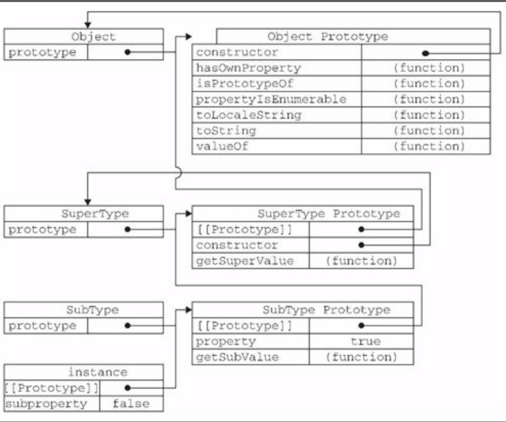

# 面向对象的程序设计

面向对象的语言有一个标志，而通过类可以创建任意多个具有相同的属性和方法的对象。但ES中没有类的概念。

在ES中把对象定义为：“无序属性的集合，其属性可以包含基本值、对象或者函数。”

每个对象都是基于一个引用类型创建的，这个引用类型可以是原生类型，也可以开发人员定义的类型。

## 理解对象

最简单的创建对象的方式

```js
Var person = new Object();
person.name = "王昱";
person.sayName = function() {
    console.log(this.name);
}
```

几年后，对象字面量成为了新的首选模式

```js
var person = {
    name : "王昱",
    sayName: funtion() {
    	console.log(this.name);
	}
}
```

### 属性类型

对象的属性在创建时都有一些特性。

ES中有两种属性：数据属性和访问器属性。

### 数据属性

数据属性包含一个数据值的位置，在这个位置可以读取和写入值。有四个特性：

`[[Configurable]] `:表示能否通过`delete`删除属性从而重新定义属性，能否修改属性的特性，能否把属性修改为访问器属性，这个特性默认值为`true`。

`[[Enumerable]]`:表示能否通过`for-in`循环返回属性。默认值为`true`。

`[[Writable]`:表示能否修改属性的值。默认值为true。

`[[Value]]`:包含这个属性的数据值。读取属性值的时候，从这个位置读；写入属性值的时候，把新值保存在这个地方。默认值为`undefined`

举一个普通例子：

```js
var person = {
    name : "wangyu" // name就是一个数据属性
};
```

 上面例子中,创建了一个名为`name`的属性, `[[Value]]` 特性将被设置为`wangyu` 其余特性都是默认值`true`

如何修改属性默认的特性,必须使用ES5中的`Object.defineProperty()`方法,接收三个参数,第一个参数是属性所在的对象,第二个参数属性的名字,第三个参数是描述符对象.

在修改数据属性的特性时，描述符对象的属性必须是: `configurable`、`enumerabel`、`writeabel`、`value`

1. 调用`Object.defineProperty()`方法把属性的`configurable`设置为`false`后，修改其他特性，都会导致错误
2. 在调用`Object.defineProperty()`方法修改属性的属性时，如果在对象中不存在此属性，那么则会添加属性，这时候，如果不指定，`configurable`、`enumerable`、`writable`默认都是`false`; 
3. 在调用`Object.defineProperty()`方法修改属性的属性时，如果在对象中已经存在此属性，这时候，如果不指定，`configurable`、`enumerable`、`writable`默认都不修改; 

```js
var person =  new Object();
Object.defineProperty(person, "name", {
    configurable: false,
    writable: false,
    value: "王昱"
});
console.log(person.name);
person.name = "张三";  // writable 为true才能修改，为false代表只读
console.log(person.name);
delete person.name;   // configurable 为true才能删除 在正常模式下什么也不会发生，严格模式下会报错
console.log(person.name);
// 在configurable设置为false后修改其他特性，会导致错误
Object.defineProperty(person, "name", {  
    writable: true,  // 抛出错误
    value: "王昱"
});  
Object.defineProperty(person, "name", {
	configurable: true, // 抛出错误
    value: "王昱"
});
```

###访问器属性

访问器属性不包含数据值，它们包含一对`get`和`set`函数（这两个函数都不是必需的）。在读取属性时，会调用`get`函数返回有效的值。在设置属性时，会调用`set`函数传入新值并处理。

`[[Configurable]] `:表示能否通过`delete`删除属性从而重新定义属性，能否修改属性的特性，能否把属性修改为数据属性，这个特性默认值为`true`。

`[[Enumerable]]`:表示能否通过`for-in`循环返回属性。默认值为`true`。

`[[Get]]`:在读取属性时调用的函数。默认值为`undefined`

`[[Set]]`:在设置属性时调用的函数。默认值为`undefined`

访问器属性不能直接定义，必须使用`Object.defineProperty()`来定义。

在修改访问起属性的特性时，描述符对象的属性必须是: `configurable`、`enumerabel`、`get`、`set`

```js
var person = {
	_age: 20,
    name: "王昱"
}

Object.defineProperty(person, "age", {
    get: function() {
        return this._age;
    },
    set: function(newValue) {
        if (newValue > this._age) {
            this._age = newValue;
        }
	}
})
person.age = 19;
console.log(person.age); // 20
person.age = 21;
console.log(person.age); // 21
```

上面的代码中，创建了一个`person`对象，并定义两个默认的属性：`_age`、`name`，带下划线的属性用于表示只能通过对象方法访问的属性。

不一定需要同时指定`get`和`set`函数。

如果只指定`get`函数，表示属性是只读的，在正常模式下，尝试写入属性会被忽略，在严格模式下，尝试写入属性会报错。

如果没有指定`get`函数，表示属性不能读，在正常模式下，返回`undefined`，在严格模式下抛出错误。

### 定义多个属性

可以用ES5中的`Object.defineProperties()`方法通过描述符一次定义多个属性。`Object.defineProperties()`接收两个参数，第一个是定义属性的对象，第二个对象的属性要与第一个对象中要定义的属性一一对应。

```js
var person = new Object();
Object.defineProperties(person, {
    _age: {
        value: 2004
    },
    name : {
        value : "王昱"
    },
    age: {
        get: function() {
       		return this._age;
   		},
        set: function(newValue) {
            if (newValue > this._age) {
                this._age = newValue;
            }
        }
    }
});
// 在同一时间定义了两个数据属性和一个访问器属性
```


### 读取属性的特性

使用ES5的`Object.getOwnPropertyDescriptor()`方法，可以取得给定属性的描述符。

这个方法接收两个参数：属性所在的对象和属性的名字。

返回值是一个对象，如果是访问器属性，这个对象的属性是: `configurable`、`enumerabel`、`get`、`set`，如果是数据属性，这个对象的属性是: `configurable`、`enumerabel`、`writable`、`value`

```js
var person = new Object();
Object.defineProperties(person, {
    _age: {
        value: 2004
    },
    name : {
        value : "王昱"
    },
    age: {
        get: function() {
       		return this._age;
   		},
        set: function(newValue) {
            if (newValue > this._age) {
                this._age = newValue;
            }
        }
    }
	
});
var descripter =  Object.getOwnPropertyDescriptor(person, "age");
console.log(descripter);  // {get: , set: , enumerable: false, configurable: false}
descripter = Object.getOwnPropertyDescriptor(person, "_age");
console.log(descripter);  // {value: 2004, writable: false, enumerable: false, configurable: false}
```

## 创建对象

使用前面的两种方式来创建对象时，有一个问题，创建多个相似的对象，需要写很多重复代码，而程序员受不了重复代码

```js
var person = {
    name : "王昱",
    age : 20,
    job : "种地",
    sayName: funtion() {
    	console.log(this.name);
	}
}

var person1 = {
	name : "张三",
    age : 21，
    job : "种地";
    sayName: funtion() {
    	console.log(this.name);
	}
}
```

### 工厂模式

考虑到ES中无法创建类，就发明了一种函数，用函数来实现上面提到的问题。

```js
function createPerson(name, age, job) {
    var o = new Object();
    o.name = name;
    o.age = age;
    o.job = job;
    o.sayName = function() {
        console.log(this.name);
    }
    return o;
}
var person1 = createPerson("王昱", 20, "种地"); 
var person2 = createPerson("张三", 21, "种地");
```

但是这样解决了上面的问题，但是还有问题没有解决，就是无法解决对象识别的问题，如何知道一个对象是什么引用类型的呢。

### 构造函数模式

ES中的构造函数可用来创建特定类型的对象。例如以前的`Object`和`Array`这样的原生构造函数。此外，我们还可以创建自定义的构造函数，从而定义自定义对象类型的属性和方法。

```js
function Person(name, age, job) {
    this.name = name;
    this.age = age;
    this.job = job;
    this.sayName = function() {
        console.log(this.name);
    }
}
var person1 = new Person("王昱", 20, "种地"); 
var person2 = new Person("张三", 21, "种地");
```

`Person`构造函数与`createPerson`函数，有部分的不同之处：

1. 没有显示的创建对象
2. 直接将属性和方法赋给了`this`对象
3. 没有`return`语句

> 构造函数始终应该以一个大写字母开头，非构造函数则应该用一个小写字母开头。

构造函数本身也是一个普通函数，只不过可以用来创建对象而已，配合`new`操作符就可以创建一个`Person`的新实例。创建会经历四个步骤：

1. 创建一个新对象
2. 将this指向这个新对象
3. 执行构造函数中的代码
4. 返回新对象

在前面的例子中，`person1`和`person2`分别保存着`Person`的一个不同的实例。这两个对象都有一个`constructor`属性，这个属性指向`Person`函数。

```js
console.log(person1.constructor === Person); // true
console.log(person2.constructor === Person); // true
```

`constructor`最初用来检测对象类型，但是检测对象类型，`instanceof`操作符要更可靠一些。

```
console.log(person1 instanceof Person); // true
console.log(person1 instanceof Object); // true
```

构造函数模式可以将它的实例标识为一种特定的类型，这就解决工厂模式无法解决的问题。`person1`有`constructor`属性，并且`person1`也是`Object`，是因为所有对象均继承至`Object`。

这种方式定义的构造函数是定义在`Global`对象中的。

1. 构造函数可以当做普通函数来用
   如果不通过`new`操作符来调用，那么构造函数跟普通函数一样。

   ```js
   var o = new Object();
   Person.call(o, "王昱", 20, "种地");
   o.sayName(); // 王昱
   
   Person("王昱", 20, "种地");
   window.sayName(); // "王昱"
   ```

2. 构造函数的问题
   构造函数也有一些缺点，主要缺点在于，每个方法都要在实例上重新创建一次。

3. ```js
   function Person(name, age, job) {
       this.name = name;
       this.age = age;
       this.job = job;
       this.sayName = new Function("console.log(this.name)"); // 跟前边的声明的方式一样
   }
   var person1 = new Person("王昱", 20, "种地");
   person1.sayName()
   var person2 = new Person("张三", 21, "种地");
   person2.sayName()
   
   console.log(person1.sayName === person2.sayName); // false
   ```

   每个方法都是一个`Function`的实例对象，不同实例上的同名函数是不相等的，但是对每个实例创建同样任务的Function实例有没有必要？

   可以利用将函数定义放在构造函数外部来解决这个问题。

   ```js
   function Person(name, age, job) {
       this.name = name;
       this.age = age;
       this.job = job;
       this.sayName = sayName;
   }
    
   function sayName(){
   	console.log(this.name)
   }
   
   var person1 = new Person("王昱", 20, "种地");
   person1.sayName()
   var person2 = new Person("张三", 21, "种地");
   person2.sayName()
   
   console.log(person1.sayName === person2.sayName); // true
   ```

   上面解决多个实例的方法创建同样任务的`Function`实例问题，但是这样一来，又有了新的问题:

   1. 某个全局作用域定义的函数只能被某种类型的对象调用，让全局作用域名不副实
   2. 如果对象需要定义多个方法，就要定义多个全局函数，那么我们自定义的这个引用类型就丝毫没有封装性可言了。


### 原型模式

我们创建的每个函数都有一个`prototype`（原型）属性，这个属性是一个指针，指向一个对象，而这个对象的用途是包含由特定类型的所有实例共享的属性和方法。

那么构造函数的`prototype`属性，就是用构造函数而创建的对象实例的原型对象。使用原型对象的好处可以让所有对象实例共享它包含的属性和方法。

```js
function Person(){   
}

Person.prototype.name = "王昱";
Person.prototype.age = 20;
Person.prototype.job = "种地";
Person.prototype.sayName = function() {
    console.log(this.name);
}

var person1 = new Person();
person1.sayName(); // 王昱
var person2 = new Person();
person2.sayName(); // 王昱
console.log(person1.sayName === person2.sayName);
```

我们把`sayName()`方法和所有属性都加到`Person.prototype`属性中，但仍然可以用构造函数创建新对象，而且新对象还会具有相同的属性和方法。

但是不同的是，新对象的这些属性和方法是有所有实例共享的。

#### 理解原型对象

创建一个新函数的时候，会为该函数创建一个`prototype`属性，这个属性指向函数的原型对象。在默认情况下，函数的`prototype`属性会自动获得一个`constructor`属性，这个属性是一个指向`prototype`属性所在的函数的指针。

```js
function Person() {   
}
console.log(Person.prototype.constructor === Person); // true
```

创建了一个自定义的构造函数以后，原型对象默认只会获得`constructor`属性，至于其他方法和属性，则都是从Object继承来的。

当调用构造函数创建一个新实例后，该实例内部包含一个指针（内部属性），指向该构造函数的`prototype`属性。ES5中管这个指针叫`[[Prototype]]`,但在脚本中没有标准的方式访问`[[Prototype]]`

>  在部分浏览器上，每个对象支持一个属性`__proto__`(不要用这个东西)来访问，而在其他宿主环境中，这个属性对脚本则是完全不可见。
>
>  ```js
>  var person = {
>  	name : "王昱",
>     sayName: function() {
>  		console.log(this.name);
>     }
>  };
>  
>  var xiaoming = new Object();
>  xiaoming.__proto__ = person;
>  xiaoming.sayName();
>  ```
>
>  ```js
>  function Person() {        
>  }
>  Person.prototype.name = "王昱";
>  Person.prototype.age = 20;
>  Person.prototype.job = "种地";
>  Person.prototype.sayName = function () {
>     console.log(this.name);   
>  }
>  var xiaoming = new Person();  
>  console.log(xiaoming.__proto__);
>  ```
>
>  

用一幅图来展示一个各个对象的关系


>  从图上可以看到实例对象和构造函数没有直接联系。

虽然我们没法直接访问到`[[Prototype]]`，但是可以通过`isPrototypeOf()`方法来确定对象之间是否存在这种关系。如果实例对象的`[[Prototype]]`指向调用`isPrototypeOf()`方法的对象，那么就会返回`true`。

```js
function Person(){   
}

Person.prototype.name = "王昱";
Person.prototype.age = 20;
Person.prototype.job = "种地";
Person.prototype.sayName = function() {
    console.log(this.name);
}

var person1 = new Person();
var person2 = new Person();
console.log(Person.prototype.isPrototypeOf(person1)); // true
console.log(Person.prototype.isPrototypeOf(person2)); // true
```

ES5中，增加了一个新方法，叫Object.getPrototypeOf()，在所有支持的实现中，这个方法返回`[[Prototype]]`的值。

```js
function Person() {
}

Person.prototype.name = "王昱";
Person.prototype.age = 20;
Person.prototype.job = "种地";
Person.prototype.sayName = function () {
    console.log(this.name);
}
var xiaoming = new Person();

console.log(Object.getPrototypeOf(xiaoming));
```


每当代码读取某个对象的某个属性或者方法时，都会执行一次搜索目标是给定名字的属性，如果在实例中找到了，则返回该属性的值，如果没有找到，则继续搜索指向的原型对象，如果在原型对象中找到了这个属性，则返回属性的值。

怎么检测一个属性是存在于实例中，还是存在于原型中？

利用`hasOwnProperty()`方法，这个方法只有给定的属性存在于对象实例中的时候，才会返回`true`。

```js
function Person() {
}

Person.prototype.name = "王昱";
Person.prototype.age = 20;
Person.prototype.job = "种地";
Person.prototype.sayName = function () {
    console.log(this.name);
}

var person1 = new Person;
person1.name = "张三";
person1.sayName(); // 张三  实例跟原型有同名属性时，会返回实例的属性值

console.log(person1.hasOwnProperty("name")); // true 存在于实例中

delete person1.name; 
person1.sayName(); // 王昱 删除实例中的属性时，会返回原型的属性值
var person2 = new Person;
person2.sayName(); // 王昱  实例没有该属性时，返回原型的属性值

console.log(person2.hasOwnProperty("name")); // false 不存在于实例中
```

#### 原型和in操作符

有两种方式使用in操作符：

单独使用和在`for-in`循环中使用。

#####单独使用`in`操作符

在单独使用时，in操作符会在通过对象能够访问给定属性时返回true，无论该属性存在于实例中还是原型中，所以可以用`hasOwnProperty()`方法和`in`操作符来确定属性到底存在于对象中，还是存在于原型中。

```js
function Person() {
    this.weight = 150
}
Person.prototype.name = "王昱";
Person.prototype.age = 20;
var person1 = new Person();

console.log(person1.hasOwnProperty("weight")); // true
console.log(person1.hasOwnProperty("age")); // false

console.log("name" in person1); // true
console.log("weight" in person1); // true

function hasPrototypeProperty(object, name){
    return (name in object) && !(object.hasOwnProperty(name));
}

console.log(hasPrototypeProperty(person1, "name")); // true
console.log(hasPrototypeProperty(person1, "weight")); // false

person1.name = "王昱";
console.log(hasPrototypeProperty(person1, "name")); // false
```

#####`for-in`循环语句

使用`for-in`循环语句返回的是所有能够通过对象访问的、可枚举的（enumerated）属性，其中既包括存在于实例中的属性，也包括存在于原型中的属性。

此外，`Object.keys()`返回了对象上所有可枚举的实例属性，接受一个对象为参数。

此外，`Object.getOwnPropertyNames()`返回了对象上所有的实例属性，不管可不可以枚举。

```js
function Person() {
    this.weight = 150,
    this.sayWeight = function(){
        console.log(this.weight);
    }
}
Person.prototype.name = "王昱";
Person.prototype.age = 20;
var person1 = new Person();

Object.defineProperties(person1, {
    "_job" : {
        value:"种地"
    },
    "height": {
        value: 120
    },
    "age": {
        enumerable: true,
        get: function() {
			return this._job;
        }
    }
});

console.log(Object.keys(person1)); // ["weight", "sayWeight", "job"]
console.log(Object.getOwnPropertyNames(person1)); // ["weight", "sayWeight", "_job", "height", "job"]

for (var property in person1) {
    console.log(property); // weight/sayWeight/job/name/age
}

```

#### 更简单的原型语法

可以用一个包含所有属性和方法的对象字面量来重写整个原型对象。

```js
function Person() {
    
}

Person.prototype = {
    name: "王昱",
    age: 20,
    job: "种地",
    sayName:function() {
    	console.log(this.name)
	}
}
```

我们将`Person.prototype`设置为一个以字面量形式创建的新对象，最终结果相同。但是注意：`Person.prototype`的`constructor`属性不再指向`Person`了。

默认情况：


所以即：

```js
Person.prototype.construcrot = Person
```

但是用对象字面量重写原型对象的时候，本质上是重写了默认的`prototype`对象，因此`constructor`属性也就变成了新对象的`constructor`属性（即默认的Object构造函数），

```js
function Person() {
    
}

Person.prototype = {
    name: "王昱",
    age: 20,
    job: "种地",
    sayName: function() {
    	console.log(this.name);
	}
}
// 相当于
// Person.prototype = new Object()
// 所以
console.log(Person.prototype.constructor === Object); // true
console.log(Person.prototype.constructor === Object.prototype.constructor); // true
```

在此时，虽然`instanceof`操作符还能返回正确的结果，但是通过`constructor`已经无法确定对象的类型了。

```js
var person1 = new Person();

console.log(Person1 instanceof Object); // true
console.log(Person1 instanceof Person); // true

console.log(Person1.constructor === Person); // false
console.log(Person1.constructor === Object); // true
```

如果`constructor`的值很重要的话，可以这样来解决上面的问题：

```js
function Person() {
}
Person.prototype = {
    constructor: Person,
    name: "王昱",
    age: 20,
    job: "种地",
    sayName: function() {
    	console.log(this.name);
	}
}

console.log(Object.keys(Person.prototype)); // ["constructor", "name", "age", "job", "sayName"]
```

这样就显示的重设了`constructor`属性，可以保证可以正常使用该属性。但是在默认情况下，原生的`constructor`是不可枚举的 ，但是在这种情况下，`constructor`变成可枚举的属性了，因为以这种方式重设，`[[Enumerable]]`特性默认为`true`。所以可以配合`Object.defineProperty()`方法来修改`constructor`属性的默认特性。

```js
function Person() {
}
Person.prototype = {
    name: "王昱",
    age: 20,
    job: "种地",
    sayName: function() {
    	console.log(this.name);
	}
}
Object.defineProperty(Person.prototype, "constructor", {
    enumerable: false,
    value: Person
})

console.log(Object.keys(Person.prototype)); // ["name", "age", "job", "sayName"]
```

#### 原型的动态性

由于在原型中查找值的过程是一次搜索，因为我们对原型对象做的任何修改都能立即从实例上反映出来，即使是先创建了实例后修改原型也照样如此。

```js
function Person() {
    
}
var friend = new Person();
Person.prototype.sayHi = function() {
    console.log("hi");
}
friend.sayHi();// hi 正常调用，没有问题。
```

由于实例与原型之间的松散连接关系，当我们调用`sayHi()`的时候，会先在实例中搜索名为`sayHi`的方法，在没找到的情况下，会继续搜索原型。因为实例与源性之间的连接只不过是一个指针，所以可以在原型中找到新的`sayHi`方法。

但是如果重写了原型对象的话，情况就不一样了。调用构造函数时，会自动为实例添加一个指向原型的`[[prototype]]`属性，把原型重写后，但实例的`[[prototype]]`属性还未发生变化。那么在重写的原型上添加的方法，实例调用就会出问题。

```js
function Person() {
    
}
var friend = new Person();
Person.prototype = {
    sayHi: function() {
        console.log("hi");
    }
}
Object.defineProperty(Person.prototype, "constructor", {
    enumerable: false,
    value: Person
})

friend.sayHi(); // 报错

```


#### 原声对象的原型

原型模式的重要性不仅表现在创建自定义类型方面，就连所有的原生引用类型都在其构造函数的原型上定义了定义了方法。

```js
// 例如
console.log(Array.prototype.sort); // function 
console.log(String.prototype.substring); // function 
```

所以 通过原生对象的原型，为原生对象添加新方法，还可以像修改自定义对象的原型一样修改原声对象的原型。

```js
String.prototype.startsWith = function(text) {
	return this.indexOf(text) === 0;
}

var msg = "Hello world";
msg.startsWith("Hello"）; // true
```

虽然可以，但是不建议这样做，一方面，很可能会导致命名冲突，另一方面，可能不小心重写了原生方法。

####原型对象的问题

原型模式也存在一些问题。原型模式的最大问题是由其共享的特性导致的。

原型对象的所有属性都被很多实例共享，对于函数是合适的，对基本类型的属性也还可以，但是对于引用类型的属性来说，问题就比较突出了。

```js
function Person() {
}

var person1 = new Person();
var person2 = new Person();

Person.prototype.children = new Object();
console.log(person1.children === person2.children); // true
person1.children.name = "王二";
console.log(person2.children.name); // 王二  修改person1的children属性，也会影响到其他实例的children值
```

所以，一般来说，实例一般都要有自己的全部属性的。

### 组合使用构造函数模式和原型模式

创建自定义类型的最常见方式，就是组合使用构造函数模式和原型模式，构造函数用于定义实例属性，而原型模型用于定义方法和共享的属性。

这样的好处，

1. 每个实例都有会有自己的一份实例属性，但同时又共享者对方法的引用，最大限度的节省了内存。
2. 这种方式还支持向构造函数传递参数。

我们这里重写前边的例子

```js
function Person(name, age, job) {
    this.name = name;
    this.age = age;
    this.job = job;
    this.children = new Object()
}

Person.prototype.sayName = function () {
    console.log(this.name);
}

var person1 = new Person("王昱", 20, "种地");
var person2 = new Person("张三", 15, "不种地");

console.log(person1.sayName === person2.sayName); // true
console.log(person1.children === person2.children); // false
```

实例属相都是在构造函数中定义的，共享的是`sayname`，在原型中定义。

这种模式定义应用类型的默认模式，最受欢迎的，认同度最高的一种模式。

### 动态原型模式

有一种方式，可以把所有信息都封装在构造函数中，又保持了构造函数和原型模式混合的优点。

```js
function Person(name, age, job) {
    this.name = name;
    this.age = name;
    this.job = job;

    // 注意这里。只有在sayName方法不存在的情况下，才会将它添加在原型中。
    // 只需要if检查一个方法就可以了。
    if (typeof this.sayName != "function") {
        Person.prototype.sayName = function () {
            console.log(this.name);
        };
        Person.prototype.sayHi = function () {
            console.log("Hi");
        };
        
        //  不要这样写
        //  走到这一句的时候，实例已经创建好了，
        /*
        Person.prototype = {
            sayName: function () {
                console.log(this.name);
            },
            sayHi: function () {
                console.log("Hi");
            }
        };
        */
    }
}

var person1 = new Person("王昱", 20, "种地")
person1.sayName() // 王昱 
person1.sayHi()   // Hi
```

>  在使用动态原型模式时，不能使用对象字面量重写原型，在已经创建了实例的情况下重写原型，就会切断现有实例和新原型之间的关系。
>
>  


### 寄生构造函数模式

通常，在前面几种模式都不适用的情况下，可以使用寄生构造函数模式。这种模式的基本思想是创建一个函数，该函数的作用仅仅是封装创建对象的代码。然后再返回新创建的对象，但从表面看，这个函数又很像是典型的构造函数。

```js
function Person(name, age, job) {
    var o = new Object();
    o.name = name;
    o.age = name;
    o.job = job; 
    return o;
}
var person1 = new Person("王昱", 20, "种地");
```

除了使用new操作符并把使用的包装函数叫做构造函数外，跟工厂模式是一模一样的，构造函数在不返回值的情况下，默认会返回新对象实例，而通过在构造函数末尾添加`return`语句，可以改变调用构造函数时返回的值。

适用范围：

在特殊的情况下用来为对象创建构造函数，假设想建一个具有额外方法的特殊数组，但是又不合适直接修改`Array`构造函数，这种情况下可以使用这个模式。

```js
function SpecialArray() {
    var values = new Array();
    values.push.apply(values, arguments);
    value.toPipedString = function() {
        return this.join("|");
    }
    return values;
}

var colors = new SpecialArray("red", "green", "blue");
colos.toPipedString(); // red|green|blue
```

> 返回的对象与构造函数或者构造函数的原型属性没有任何关系。所以不能用`instanceof`来确定引用类型。
>
> 在可以用其他模式的情况下，别用这个模式

### 稳妥构造函数函数

所谓稳妥对象，指的是没有公共属性，而且方法中也不引用this的对象。适合在一些安全的环境中（这些环境中不允许用`this`和`new`），或者在防止数据被其他应用程序改动时使用。

稳妥构造函数函数与寄生构造函数有一些类似，但是有两点不同：

1. 不能使用new操作符
2. 新创建的对象的实例方法不引用this

```js
function Person(name, age, job) {
    var o = new Object();
    o.sayName = function() {
        console.log(name);
    }
    return o;
}
```

以这种模式创建的对象中，除了使用`sayName()`方法外，没有其他办法访问`name`的值

```js
var friends = Person("王昱", 20, "种地");
friend.sayName();
```

> 变量person中保存的是一个稳妥对象，而除了调用sayName()方法外，没有别的方式可以访问其数据成员。即使有其他代码会给这个对象添加方法或数据成员，但也不可能有别的办法访问传入到构造函数中的原始数据。稳妥构造函数模式提供的这种安全性，使得它非常适合在某些安全执行环境——例如，ADsafe（www.adsafe.org）和Caja（http://code.google.com/p/google-caja/）提供的环境下使用。

返回的对象与构造函数或者构造函数的原型属性没有任何关系。所以不能用`instanceof`来确定引用类型。

## 继承

### 原型链

ES中描述了原型链的概念，并将原型链作为实现继承的主要方法。

其基本思想是利用原型让一个引用类型继承另一个引用类型的属性和方法。


假如让原型对象等于另一个类型的实例，结果会怎么样？

此时的原型对象将包含一个指向另一个原型的指针。另一个原型中也包含着一个指向另一个构造函数的指针。

```js
function SuperType() {
    this.property = true;
}
SuperType.prototype.getSuperValue = function () {
    return this.property;
}
function SubType() {
    this.subproperty = false;
    this.property = false;
}
SubType.prototype = new SuperType();
SubType.prototype.getSubValue = function () {
    return this.subproperty;
}

var instance = new SubType();
console.log(instance.getSuperValue()); // false
```

上图中的关系可以用这张图来表示


```js
// instanceof 
function instance_of(L, R) {//L 表示左表达式，R 表示右表达式
     var O = R.prototype;// 取 R 的显示原型
     L = Object.getPrototype(L);// 取 L 的隐式原型
     while (true) { 
       if (L === null) 
         return false; 
       if (O === L)// 这里重点：当 O 严格等于 L 时，返回 true 
         return true; 
       L = Object.getPrototype(L); 
     } 
}
```

当访问一个实例的属性时，首先会在实例中搜索该属性，如果没有找到，则会继续搜索实例的原型。在通过原型链实现继承的情况下，搜索过程就得以沿着原型链继续向上。

就拿上面的例子来说，调用instance.getSuperValue()会经历三个搜索步骤

1. 搜索实例
2. 搜索SubType.prototype
3. 搜索SuperType.prototype

再找不到的属性或者方法的情况下，搜索过程总是要一环一环地前行到原型链末端才会停下来

####别忘记默认的原型

所有引用类型默认都继承了Object,而这个继承也是通过原型链实现的。大家要记住，所有函数的默认原型都是Object的实例，因为默认原型都会包含一个内部指针，指向Object.prototype。这也正是所有自定义类型都会继承`toString()`、`valueOf()`等默认方法的根本原因。

```js
function Student() {
}

console.log(Object.getPrototypeOf(Student.prototype) === Object.prototype) // true
```

所以，完整的原型链应该是如下图



SubType继承了SuperType.而SuperType继承了Object,当调用实例的`toString()`方法时，实际上调用的是保存在Object.prototype中的那个方法。

#### 确定原型和实例的关系

可以通过两种方式来确定原型和实例之间的关系。

1. `instanceof`操作符
   只要用这个操作符来测试实例和原型链中出现过的构造函数，结果就会返回`true`
2. `isPrototypeOf`
   只要是原型链中出出现过的原型，都可以说是该原型链所派生的实例的原型。

#### 谨慎的定义方法

由于子类型有时候需要重写超类型方法或者添加超类型中不存在的某个方法，需要把这种情况下的代码放在替换原型的语句以后。

```js
function SuperType() {
    this.property = true;
}
SuperType.prototype.getSuperValue = function () {
    return this.property;
}
function SubType() {
    this.subproperty = false;
    this.property = false;
}
// 替换原型，这句话要放在前边，否则添加或者重写的方法不起作用
SubType.prototype = new SuperType();
// 添加新方法
SubType.prototype.getSubValue = function () {
    return this.subproperty;
}
// 重写超类型的方法
Subtype.prototype.getSuperValue = function () {
    return false;
}

var instance = new SubType();
console.log(instance.getSuperValue()); // false
```

而且，通过原型链实现继承时，不能使用对象字面量创建原型方法，这样做会重写原型，会切断希望的原型链-会导致SubType和SuperType的之间已经没有关系了。

```js
function SuperType() {
    this.property = true;
}
SuperType.prototype.getSuperValue = function () {
    return this.property;
}
function SubType() {
    this.subproperty = false;
    this.property = false;
}
// 替换原型
SubType.prototype = new SuperType();
// 对象字面量创建原型， 会覆盖上面的替换原型的语句
SubType.prototype = {
    function getSubValue() {
	    return this.subproperty;
	}
    function getSuperValue() {
    	return false;
	}
} 

var instance = new SubType();
console.log(instance.getSuperValue()); // false
```

#### 原型链的问题

原型链虽然很强大，但是存在一些问题。

1. 最主要的问题来自包含引用类型类型值的原型。

所有SubType的实例，都共享SuperType的实例的引用类型属性，所以当修改时会互相影响。道理类似于


2. 不能方便给超类型构造函数传递参数

   ```js
   function SuperType(name) {
       this.name = name;
       this.colors = ["red", "blue", "green"];
   }
   
   SuperType.prototype.sayName = function() {
   	console.log(this.name);
   }
   
   function SubType(name, age) {
   	// name传递的问题
       this.age = age;
   }
   
   SubType.prototype = new SuperType();
   SubType.prototype.sayAge = function() {
       console.log(this.age);
   }
   
   var instance1= new SubType("王昱", 29);
   ```


## 借用构造函数

在解决原型链的问题时，可以使用一种借用构造函数的技术（有时候也叫做伪造对象或经典继承）。

这种技术的基本思想相当简单，即在子类型构造函数的内部调用超类型构造函数，并且借用`apply()`或`call()`。

```js
function SuperType(name) {
    this.name = name;
	this.colors = ["red", "blue", "green"];
}

function SubType(name, age) {
    // 继承了SuperType
    SuperType.call(this, name); // 相当于this.colors = ["red", "blue", "green"]; 可以达到每个实例就都会具有自己的colors属性
    this.age = age;
}
```

为了确保`SuperType`构造函数不会重写子类型的属性，可在把调用超类型的构造函数放在子类型的构造函数的第一句。

### 借用构造函数的问题

仅仅是借用构造函数，又无法避免构造函数模式存在的问题  :  方法都在构造函数中定义，因为函数复用就无从谈起了。道理类似于：


## 组合继承

组合继承，有时候也叫做伪经典继承，指的是将原型链和借用构造函数的技术组合到一起，从而发挥二者之长的一种继承模式。

借用原型链实现对原型属性和方法的继承。

借用构造函数实现对实例属性的继承。

```js
function SuperType(name) {
    this.name = name;
    this.colors = ["red", "blue", "green"];
}

SuperType.prototype.sayName = function() {
	console.log(this.name);
}

function SubType(name, age) {
    SuperType.call(this.name);
    this.age = age;
}

SubType.prototype = new SuperType();
SubType.prototype.sayAge = function() {
    console.log(this.age);
}

var instance1= new SubType("王昱", 29);
instance1.colors.push("black");
console.log(instance1.colors);
console.log(instance1.sayName());
console.log(instance1.sayAge());

var instance2= new SubType("张三", 28);
console.log(instance2.colors);
console.log(instance2.sayName());
console.log(instance2.sayAge());
```

这样一来不同的SubType实例分别具有自己的属性以及相同的方法。组合继承是Js中最常用的继承模式。

## 原型式继承

道格拉斯介绍了一种是实现继承的方式，他的想法是借助原型可以基于已有的对象创建新对象，同时还不必因为创建自定义类型。

```js
function object(o) {
	function F(){};
    F.prototype = o;
    return new F();
}
```

例如：

```js
var person = {
    name: "Nicholas",
    friends: ['Court', 'Van', 'Shelby']
};

var anotherPerson = object(person);
anotherPerson.name = 'grey';
anotherPerson.friends.push("Rob");

console.log(person.friends); // ["Court", "Van", "Shelby", "Rob"]
```

从本质上，`object()`对传入其中的对象执行了一次浅复制。

这种原型式继承，要求你必须有一个对象作为另一个对象的基础。如果有这么一个对象的话，可以把它传递给`object()`函数，然后再对返回的对象根据需求加以修改就可以了。上边的例子中，是其他对象的基础的是`person`对象。


ES5通过新增`Object.create()`方法规范了原型式继承，这个方法接收两个参数：一个用作新对象原型的对象和（可选的）一个为新对象定义额外属性的对象。

在传入一个参数的情况下，`Object.create()`与`object()`方法的行为相同。

`Object.create()`方法的第二个参数与`Object.defineProperties()`方法的第二个参数格式相同，每个属性都是通过自己的描述符定义的。以这种方法制定的任何属性都会覆盖原型对象上的同名属性。

## 寄生式继承

寄生式继承是与原型式继承紧密相关的，因为调用`object()`产生新对象后，需要给新对象增加属性和方法，寄生式继承创建一个仅用于封装继承过程的函数。

```js
function createAnother(original){
    var clone = object(original);
    clone.sayHi = function(){ // 增加方法
        console.log('hi');
    }
    clone.name = '王昱';
    return clone; 
}

function object(o) {
	function F(){};
    F.prototype = o;
    return new F();
}

var person = {
    name: "Nicholas",
    friends: ['Court', 'Van', 'Shelby']
};

var anotherPerson = createAnother(person);
anotherPerson.sayHi(); // 'hi'
```

在主要考虑对象而不是自定义类型和构造函数的情况下，寄生式继承也是一种有用的模式。前面示范继承模式时使用的`object()`函数不是必需的，任何能够返回新对象时函数都适用于此模式。

> 使用寄生式继承来为对象添加方法，会由于不能函数复用而降低效率，这一点与构造函数类似。

## 寄生组合式继承

组合继承是`js`中最常用的继承模式，但是有一个不足是：无论什么情况下，都会调用两次超类型构造函数： 一次是创建子类型原型时，一次是在子类型构造函数内部。

```js
function SuperType(name) {
    this.name = name;
    this.colors = ["red", "blue", "green"];
}

SuperType.prototype.sayName = function() {
	console.log(this.name);
}

function SubType(name, age) {
    SuperType.call(this.name);  // 第二次调用超类型构造函数
    this.age = age;
}

SubType.prototype = new SuperType(); // 第一次调用超类型构造函数
SubType.prototype.sayAge = function() {
    console.log(this.age);
}
```

怎么解决这种问题？

使用寄生组合式继承，即通过借用构造函数来实现继承属性，通过原型链的混成形式来继承方法。

基本思路是：不必为了指定子类型的原型而调用超类型的构造函数，所需要的无非就是超类型原型的一个副本。本质上，就是使用寄生式继承来继承超类型的原型，然后再将结果指定给子类型的原型。

寄生式组合继承的基本模式如下所示。

```js
function inheritPrototype(SubType, SuperType) {
    var prototype = object(SuperType.prototype);
    prototype.constructor = SubType;
    SubType.prototype = prototype;
}
```

这函数接受两个参数：子类型构造函数和超类型构造函数，在函数内部：

第一步是基于超类型原型创建的一个对象；

第二步是为创建的对象添加`constructor`属性，从而弥补因重写原型而失去的默认的`constructor`属性；

第三步是将新创建的对象赋值给子类型的原型。

所以可以用`inheritPrototype`函数去解决前面的问题了。

```js
function SuperType(name) {
    this.name = name;
    this.colors = ["red", "blue", "green"];
}

SuperType.prototype.sayName = function() {
	console.log(this.name);
}

function SubType(name, age) {
    SuperType.call(this.name);  // 第二次调用超类型构造函数
    this.age = age;
}

inheritPrototype(SubType,SuperType);
SubType.prototype.sayAge = function() {
    console.log(this.age);
}
```

这样就可以只调用了一次`SuperType`构造函数，并且因此避免了在`SubType.prototype`上面创建不必要，多余的属性。与此同时，原型链还能保持不变，还能正常使用`instanceof()`和`isPrototypeOf()`。

开发人员普遍认为寄生组合式继承是引用类型最理想的继承范式。

