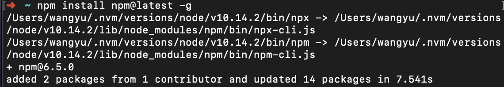
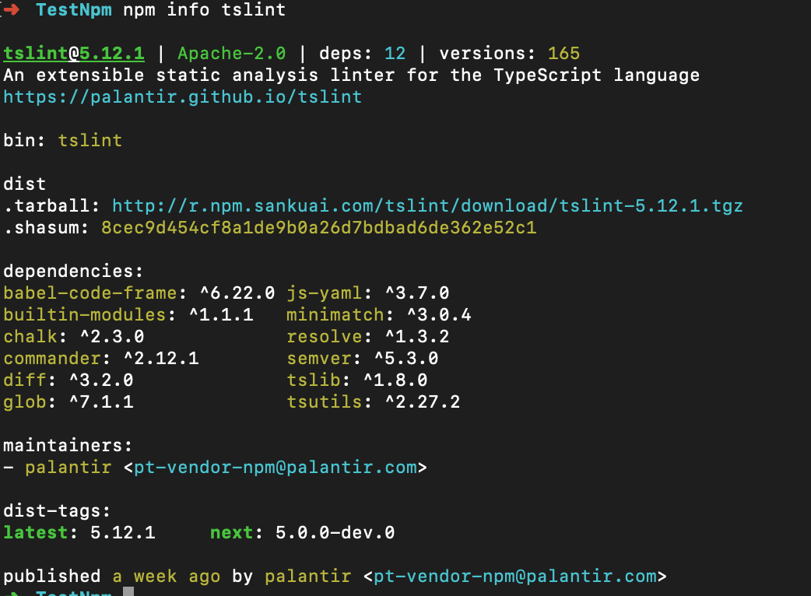
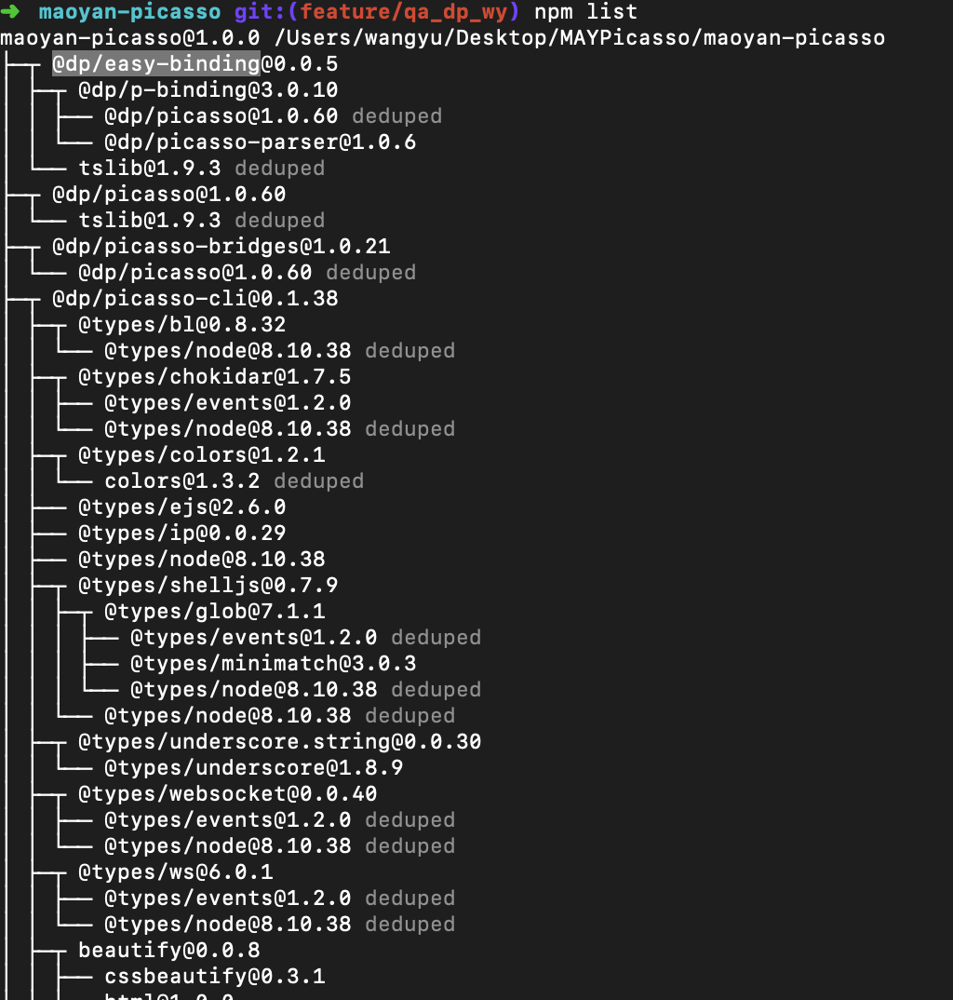
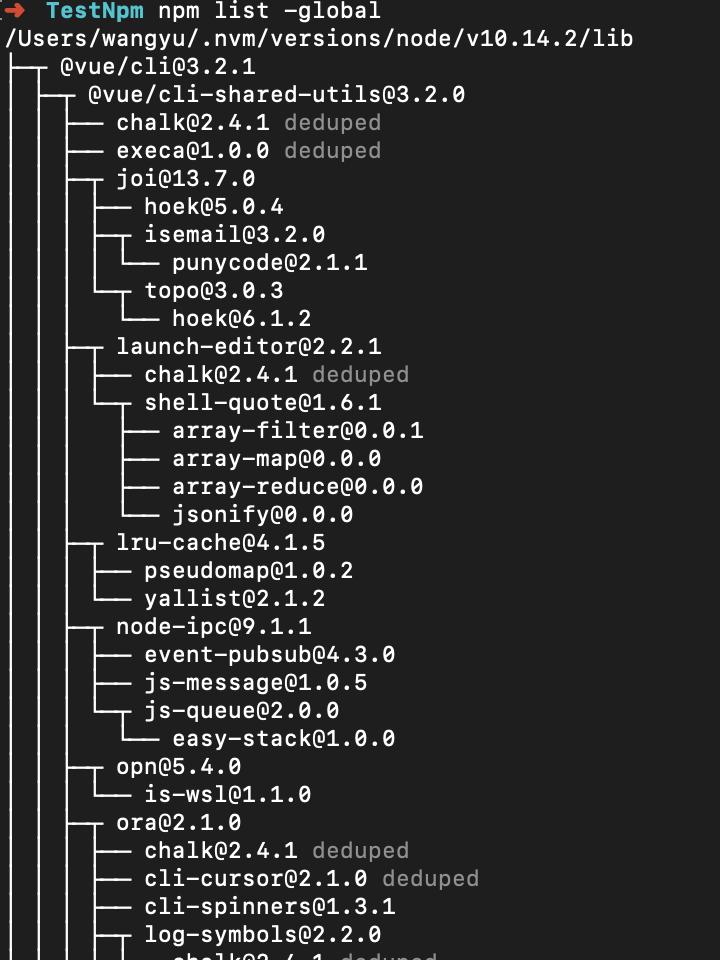
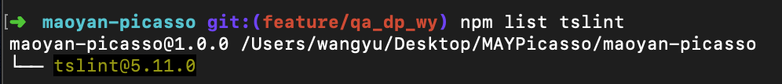
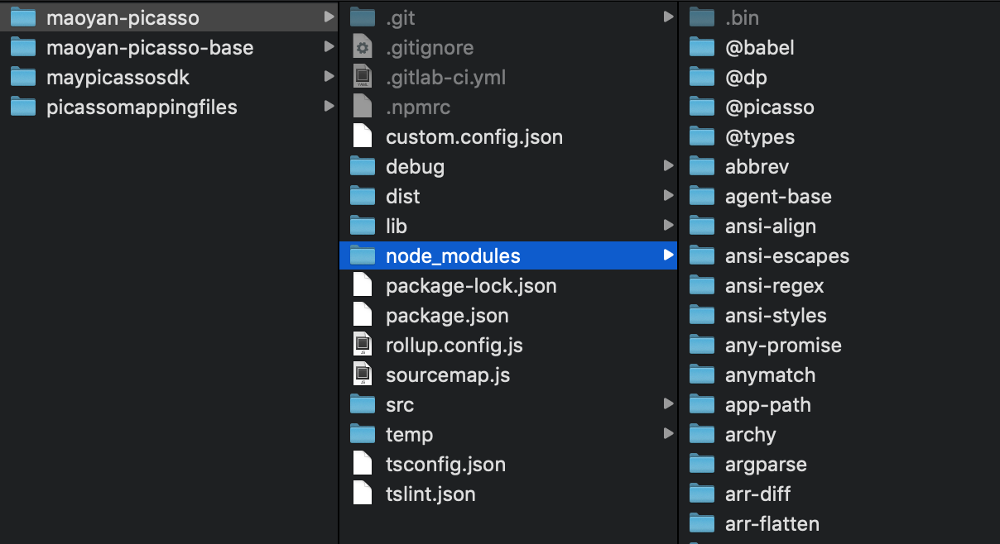

# npm 学习

##简介：

`npm`有两层含义：

一层含义是 `Node`的开放式模块登记和管理系统，地址是 https://www.npmjs.com/

第二层含义是：`Node`默认的模块管理器，是一个命令行下的软件，用来安装和管理`Node`模块。

`npm`不需要单独安装。在安装`Node`的时候，会连带一起安装`npm`。但是，`Node`附带的`npm`可能不是最新版本，最好用下面的命令更新到最新版本

```shell
npm install npm@latest -g 
```



`@latest` 表示最新版本，`-g`表示全局安装，命令的主干是`npm install npm`，之所以可以这样，是因为`npm`本身与`Node`的其他模块没有区别。

运行下面的命令，查看各种信息。

```shell
npm help  #查看npm命令列表
```


```shell
npm -v #查看npm的版本
```


```shell
npm -l #查看各个命令的简单用法
npm config list -l #查看npm的配置
```

## 1. npm init

这个命令会引导你创建`package.json`文件。并且会向你提问一系列问题，如果你觉得不用修改默认配置，一路回车就可以了，如果觉得需要修改，就填写你希望的值，然后回车就可以了。

默认配置仅涵盖了最常见的配置字段，并尝试猜测合理的默认值。


可以使用`npm help json`来查看这些字段的意义。


如果使用了 `-f`(代表force)、`-y`(代表yes)，则跳过提问阶段，直接生成一个新的`package.json`文件。


## 2. npm set

npm set 用来设置环境变量

```shell
npm set init-authoer-name "wangyu"
npm set init-authoer-email "584714135@qq.com"
npm set init-license "MIT"
```

上面命令相当于为`npm init`设置了默认值，以后再执行`npm init`的时候，`package.json`的作者、作者邮箱、许可证字段就自动写入预设的值。


这些信息会存放在用户主目录的`~/.npmrc`文件，使得用户不用每个项目都输入。如果某个项目有不同的设置，可以针对该项目运行`npm config`。


以下命令设置加入模块时，`package.json`将记录模块的确切版本，而不是一个可选的版本范围。

```shell
npm set save-exact true
```

## 4. npm config

```
npm config set prefix $dir
```


## 5. npm info

`npm info`命令可以查看每个模块的具体信息。比如查看`tslint`模块的信息




## 6. npm search

`npm search`命令用于搜索`npm`仓库，它后面可以跟字符串，也可以跟正则表达式

```shell
npm search <packageName>
```


## 7. npm list

`npm list`命令以树形结构列出当前项目安装的所有模块，以及他们依赖的模块。

```
npm list 
```



加上`global`参数，会列出全局安装的模块

```
npm list -global
```



`npm list`命令也可以列出单个模块

```
npm list tslint
```




## 8. npm install

###8.1 基本用法

Node模块采用`npm install`命令安装

每个模块可以全局安装，也可以“本地安装”。“全局安装”指的是将一个模块安装到系统目录中，各个项目都可以调用。一般来说，全局安装只适用于工具模块，比如`eslint`和`gulp`。"本地安装"指的是将一个模块下载到当前项目的`node_moudles`子目录，然后只有在项目目录之中，才能调用这个模块。




```
#本地安装
npm install <package name> 

# 全局安装
sudo npm install -global <package name>
sudo npm install -g <package name>
```

`npm install`也支持直接输入Github代码库地址。

```
npm install git://github.com/package/path.git
npm install git://github.com/package/path.git#0.1.0
```

安装之前，`npm install `会先检查，`node_modules`目录中是否已经存在指定模块，如果存在，就不再重新安装了，即使远程仓库已经有了一个新版本，也是如此。

如果你希望，一个模块不管是否安装过，npm都要强制重新安装，可以使用`-f`和`--force`参数。

```
npm install <package name> --force
```

如果你希望，所有模块都要强制重新安装，那就删除`node_modules`目录，重新执行`npm install`

```
rm -rf node_modules
npm install 
```

###8.2 安装不同版本

`install`命令总是安装模块的最新版本，如果要安装模块的特定版本，可以在模块后面加上`@`和版本号

```
npm install @picasso/picasso-images@latest  
npm install @picasso/maoyan-base@1.0.0    
```

如果使用`--save-exact`参数，会在`package.json`文件指定安装模块的确切版本。

```
npm install tslint --save --save-exact
```

`install `命令可以使用不同参数，指定所安装的模块属于哪一种性质的依赖关系，即出现在`package.json`文件的哪一项中。

> `-save`： 模块名将被添加到`dependencies`,可以简化为参数`-S`
>
> `-save-dev`：模块名将被添加到`devDependencies`，可以简化为参数`-D`

如果要安装beta版本的模块，需要使用下面的命令。

``` 
npm install <module-name>@beta (latest beta)
npm install <module-name>@1.3.1-beta.3
```

`npm install`默认会安装`dependecices`字段和`devDependecies`字段中的所有模块，如果使用`--production`参数，可以只安装`dependecies`字段的模块。

```
npm install --production
NODE_ENV=production npm install
```

## 9. 避免系统权限 * 

默认情况下，`Npm`全局模块都安装在系统目录(比如：`/usr/local/lib/`)，普通用户写入权限，需要用到`sudo`命令。这不是很方便，我们可以在没有root权限的情况下，安装全局模块。

首先，在主目录下新建配置文件`.npmrc`，然后在该文件中将`prefix`变量定义到主目录下面。

## 10. npm update, npm uninstall

`npm update`命令可以更新本地安装的模块

```
# 升级当前项目的指定模块
npm update [package name]
# 升级全局安装的模块
npm update -global [package name]
```

会先到远程仓库查询最新版本，然后查询本地版本，如果本地版本不存在，或者远程版本较新，就会安装

如果使用-s 或者 --save 参数，可以在安装的时候更新`package.json`里面模块的版本号。

从`npm v2.6.1`开始，npm update 只更新顶层模块，而不更新依赖的依赖，以前版本是递归更新的。如果想取到老版本的效果，要使用下面的命令

```
npm --depth 9999 update
```

`npm uninstall`命令，卸载已安装的模块。

```
npm uninstall [package name]
npm uninstall [package name] -global
```

## 11. npm run 

npm 不仅可以用于模块管理，还可以用于指定脚本。`package.json`文件中有一个`scripts`字段，可以用于指定脚本命令，供`npm`直接调用。

