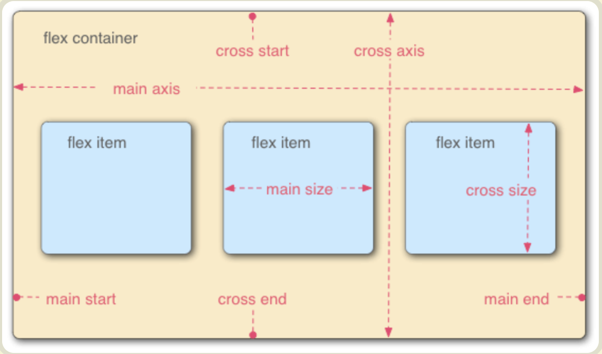
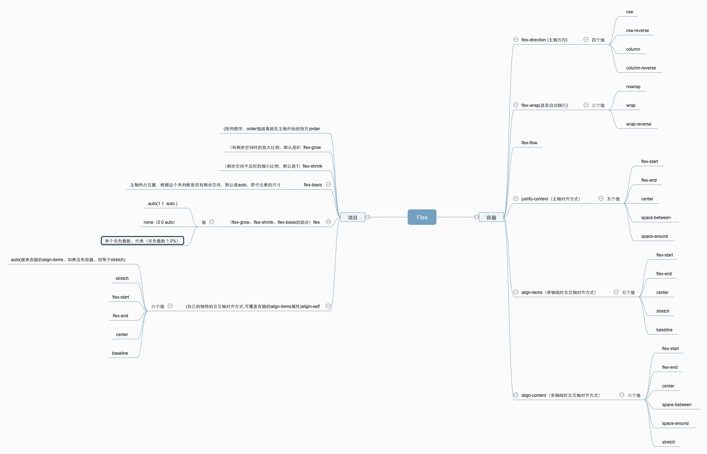

# Flex布局

`Flex`是`Flexible Box`的缩写，指的是弹性布局。

任何一个容器都可以指定为`Flex`布局

```css
.box {
    display: flex;
}
```

行内元素也可以使用`Flex`布局

```css
.box {
	display: inline-flex;
}
```

Webkit内核的浏览器，必须加上`-webkit`前缀

```css
.box {
    display:-webkit-flex; /* safari */
    display: flex;
}
```

注意，设为`Flex`布局以后，子元素的`float`、`clear`和`vertical-align`属性将失效。

## 基本概念

采用`Flex`布局的元素，称为`Flex`容器（flex container），简称"容器"。他的所有子元素自动成为容器成员，称为Flex项目（flex item），简称”项目“。

容器默认存在两根轴： 水平的主轴（main axis）和垂直的交叉轴(cross axis)。主轴的开始位置叫`main start`，结束位置叫做`main end`，交叉轴的开始位置叫`cross start`，结束位置叫做`cross end`。

项目默认沿主轴排列。单个项目占据的主轴空间叫做`main size`，占据的交叉轴空间`cross size`。



##容器的属性，

以下6个属性设置在容器上

> *  flex-direction 
> * flex-wrap
> * flex-flow
> * justify-content
> * align-items
> * align-content

###flex-direction属性

flex-direction决定主轴的方法（即项目的排列方向）。

它可能有四个值：

> `row`(默认值) ： 主轴为水平方向，起点在左端
>
> `row-reverse`： 主轴为水平方向，起点在右端 
>
> `column`：主轴为水平方向，起点在顶端
>
> `column-reverse`：主轴为水平方向，起点在底端

### flex-wrap

默认情况下，项目都排在主轴上。flex-wrap属性定义，如果一条轴线排不下，如何换行。

可能有三个值：

> `nowrap`（默认值） : 不换行
>
> `wrap`: 换行，第一行在上方
>
> `wrap-reverse`: 换行，第一行在下方

在元素的宽度小于其子元素的宽度和时，

如果设为不换行（`nowrap`），可能会缩小子元素的宽度

如果设为换行（`nowrap` 或 `wrap-reverse`），则不需要缩小子元素的宽度

### flex-flow

`flex-flow` 属性是`flex-direction`属性和`flex-wrap`属性的简写形式，默认值为`row nowrap`。

### justify-content

`justify-content`属性定义了项目在主轴上的对齐方式。

可能有五个值：

> `flex-start`（默认值） : `main-start`对齐
>
> `flex-end: `main-end`对齐
>
> `center`: 主轴居中
>
> `space-between`: 两端对齐，项目之间的间隔都相等。
>
> `space-around`: 每个项目两侧的间隔相等。所以，项目之间的间隔比项目与边框的间隔大一倍。

### align-items属性

`align-items`属性定义项目在交叉轴上如何对齐。（只有一条轴线会起作用，否则不会）

可能有五个值：

> `flex-start`（默认值） : `cross-start`对齐
>
> `flex-end`: `cross-end`对齐
>
> `center`: 交叉轴居中
>
> `baseline`:项目的第一行文字的基线对齐。
>
> `stretch`（默认值）:  如果项目未设置高度或设置auto，将占满整个容器的交叉轴高度。

### align-content属性

`align-content`属性定义了多根轴线的对齐方法。（只有一条轴线时，该属性不起作用）

>`flex-start`：`cross-start`对齐
>
>`flex-end`: `cross-end`对齐
>
>`center`：与交叉轴的中点对齐。
>
>`space-between`：与交叉轴两端对齐，轴线之间的间隔平均分布。
>
>`space-around`：每根轴线两侧的间隔都相等。所以，轴线之间的间隔比轴线与边框的间隔大一倍。
>
>`stretch`（默认值）：轴线占满整个交叉轴。

## 项目的属性

以下6个属性设置在项目上。

> `order`
>
> `flex-grow`
>
> `flex-shrink`
>
> `flex-basis`
>
> `flex`
>
> `align-self`

### order

`order`属性定义项目的排列顺序，数值越小，排列越靠前，默认为0。

### flex-grow属性

`flex-grow`属性定义项目的放大比例，默认为0，即如果存在剩余空间，也不放大。

如果所有项目的`flex-grow`属性都为1，则他们将等分剩余空间（如果有剩余空间）。如果一个项目的`flex-grow`属性为2，其他项目为1，则前者占据的剩余空间将比其他项都一倍。

### flex-shrink属性

`flex-shrink`属性定义项目的缩小比例，默认为1，即如果空间不足，该项目将缩小。

如果所有项目的`flex-shrink`属性都为1，则他们将等比例缩小。

如果一个项目的`flex-shrink`属性为2，其他项目为1，则空间不足时，前者缩小的空间是其他项目的一倍。

如果一个项目的`flex-shrink`属性为0，其他项目为1，则空间不足时，前者不缩小。

### flex-basis属性

`flex-basis`属性定义了在分配多余空间之前，项目占据的主轴控件。浏览器根据这个属性，计算主轴是否有多余空间。

它的默认值为auto。

`auto`：首先检索该子元素的主尺寸，如果主尺寸不为`auto`，则使用值采取主尺寸之值；如果也是 `auto`，则使用值为 `content`。

`content`：指根据该子元素的内容自动布局。有的用户代理没有实现取 `content` 值，等效的替代方案是 `flex-basis` 和主尺寸都取 `auto`。

百分比：根据其包含块（即伸缩父容器）的主尺寸计算。如果包含块的主尺寸未定义（即父容器的主尺寸取决于子元素），则计算结果和设为 `auto` 一样。

它可以设为跟`width`或`height`属性一样的值，则项目将占据固定空间。

###flex属性

`flex`属性是`flex-grow`、`flex-shrink`和`flex-basis`的简写，默认值为`0`  `1` ` auto`。

当 `flex` 取值为一个非负数字，则该数字为 `flex-grow` 值，`flex-shrink` 取 1，`flex-basis` 取 0%。

当 `flex` 取值为一个长度或百分比，则视为 `flex-basis` 值，`flex-grow` 取 1，`flex-shrink` 取 1，有如下等同情况（注意 0% 是一个百分比而不是一个非负数字）

当 `flex` 取值为两个非负数字，则分别视为 `flex-grow` 和 `flex-shrink` 的值，`flex-basis` 取 0%，如下是等同的：

有两个快捷值： `auto`(`1` `1` `auto`)和none(`0` `0` `auto`)


### align-self属性

`align-self`属性允许单个项目有与其他项目不一样的对齐方式，可覆盖`align-items`属性，默认值为`auto`，表示继承父元素的`align-items`属性，如果没有父元素，则等于与`stretch`

该属性可能取`6`个值，除了`auto`，其余与`align-items`属性完全一致。


一篇不错的博客：https://blog.csdn.net/fengyjch/article/details/79047908

## 复习：



